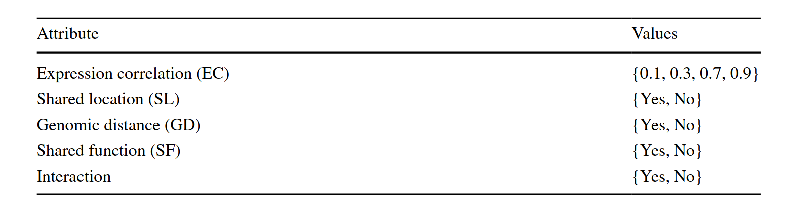
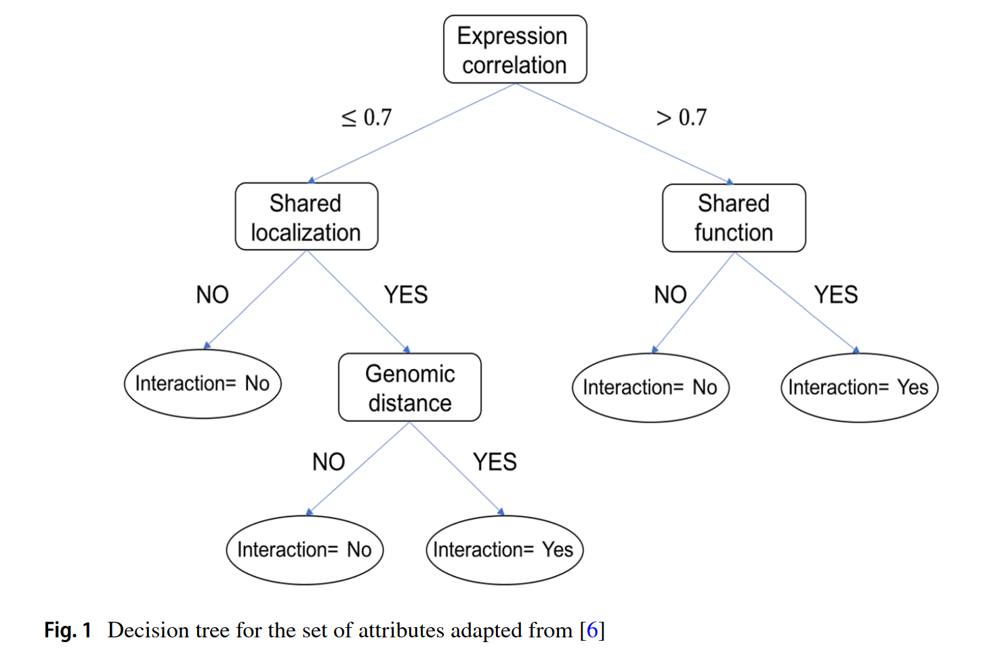

# Modeling of Decision Trees Through P Systems

https://doi.org/10.1007/s00354-019-00052-4

The tree structure can be defined naturally by the topology
of the regions in the P system and the decision rules are defined by communication rules of the P system.

A P system with evolution and communication rules of degree m ≥ 1 is
defined by the tuple Π = (O, H, 𝜇, w1, w2, ... , wm, R, i0), where

1. O is the alphabet of objects. O∗ denotes the set of all the strings defined over O.

2. . H is the alphabet of labels for membranes.

3. 𝜇 is the membrane structure, of degree m , with all membrane labels from H . A
membrane with label h is represented by [ ]h.

4. w1, w2, ... , wm are strings over O that define the multisets of objects in every
region of 𝜇.

5. R is a finite set of rules

- evolution rules
- **in** communication rules
- **out** communication rules

6. i_0 ∈ {0, 1, ... , m} is the region where the result of a computation is obtained (0 represents the environment).
