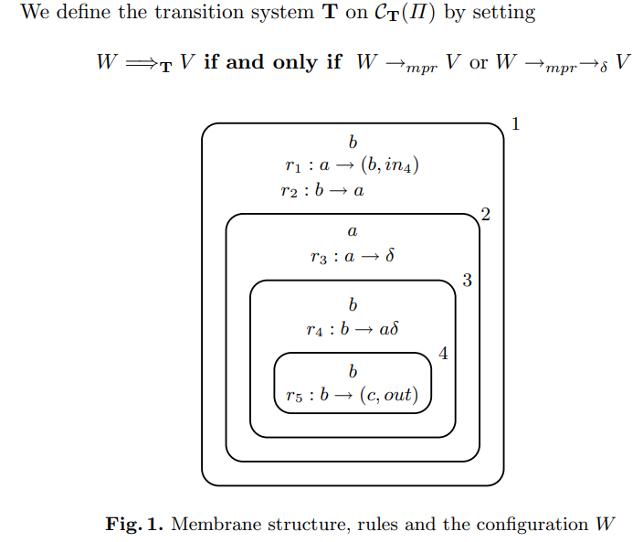
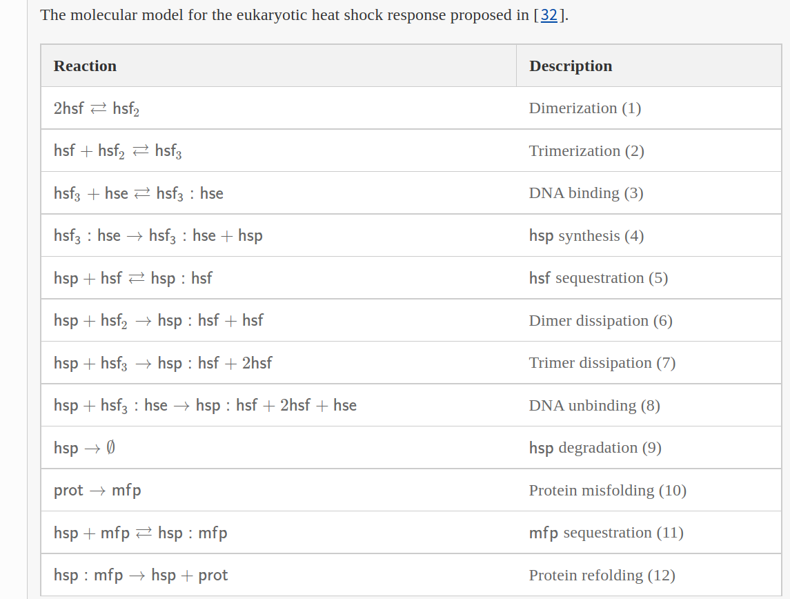

http://ppage.psystems.eu/

---

# Quantitative Causality in Membrane Systems

International Conference on Membrane Computing
CMC 2011: Membrane Computing pp 62-72

To each multiset w we associate its support, denoted by
supp(w), which contains those elements of S which have a non-zero image. 

A cover $(G, w)$ for a multiset $v$ is defined with respect to a certain evolution step 
$$ u \xrightarrow{\text{F}} u' $$
in which $v$ is obtained: $v ≤ u'$.

It is formed from a multiset of rules $G$ and a multiset of objects w such that they both contribute to the apparition of $v$. The main idea is that $G ≤ F$ is a part of the rules used in the evolution step and $w ≤ u−lhs(F)$ is a part of the objects which are not consumed by rules, such
that $v ≤ w + rhs(G)$. In other words, $v = w + (v − w)$ is obtained from $u$ in one evolution step 
$u \xrightarrow{\text{F}} u' = u − lhs(F) + rhs(F)$
, such that w are objects which are
not consumed by any rule and $v − w$ are objects produced by rules in $G$.

---

# Flattening the Transition P Systems with Dissolution

International Conference on Membrane Computing
CMC 2010: Membrane Computing pp 53-64

Given a transition P system Π with dissolution, promoters and inhibitors having several membranes, we construct a P system $Π^f$ with promoters and inhibitors and with only one membrane.  The evolution of this “flat” P system $Π^f$ simulates the evolution of initial transition P system Π by replacing any dissolution stage of a configuration in $Π^f$ by specific rules application in a configuration of $Π^f$ The transition P systems without dissolution represent a special case.

---

# Foundations of Reversible Computation

International Conference on Reversible Computation
RC 2020: Reversible Computation: Extending Horizons of Computing pp 1-40

Reversible computation allows computation to proceed not only in the standard, forward direction, but also backward, recovering past states, and computing inputs from outputs. Reversible computation has attracted interest for multiple applications, covering areas as different as low-power computing [113], simulation [37], robotics [122] and debugging [129]. 

A useful specialisation of dagger categories, in connection with reversible computation, is dagger traced symmetric bimonoidal (or rig) categories, i.e., dagger categories equipped with two symmetric monoidal tensors (usually denoted   −⊕−  and   −⊗− ), interacting through a distributor and an annihilator, yielding the structure of a rig (i.e., a ring without additive inverses). Iteration is modelled by means of a trace operator   Tr  (see [1, 85, 175]) such that   (Trf)†=Tr(f†) . These categories are strongly related to the dagger compact closed categories [3, 174] that serve as the model of choice for the Oxford school of quantum computing.

Reversible languages have been reduced to their computational cores:

R-Core [63] is a structured reversible language consisting of a single command for reversible store updates, a single control-flow operator for reversible iteration, and data structures built from a single binary constructor and a single symbol. Despite its extreme simplicity, the language is reversibly universal, which means it is as computationally powerful as any reversible language can be. Its four-line program inverter is as concise as the one for Bennett’s reversible Turing machines. The core language and a recent extension with reversible recursion were equipped with a denotational semantics [61, 63, 64].

R-While [62] adds reversible rewrite rules and pattern matching as syntactic sugar to R-Core, which makes the family of structured reversible languages more accessible to foundational studies and educational purposes than do reversible Turing machines and other reversible devices. The procedural extension [64] draws a distinction between tail-recursion by iteration and general recursion by reversible procedures, a notoriously difficult transformation problem in program inversion [96, 151]. The linear-time self-interpretability makes the language also suitable for foundational studies of computability and complexity from a programming language perspective [84].

CoreFun [80] is a typed reversible functional language that seeks to reduce reversible functional programming [184] to its essentials so that it can serve as a foundation for modern functional language concepts. The language has a formal semantics and a type system to statically check for reversibility of programs.

A term rewriting system (TRS) is specified as a set of rewrite rules of the form   l→r  such that l is a nonvariable term and r is a term whose variables appear in l.

Clavel, M., et al.: Maude: specification and programming in rewriting logic. Theor. Comput. Sci. 285(2), 187–243 (2002)

rocess calculi are a class of algebraic models for concurrent and distributed systems. Process calculi allow one to express the behaviour of a concurrent system in a concise way, abstracting away from implementation details, and focusing on the interaction patterns among the components of the system. Thus, it is possible to express the behaviour of a system in a mathematically precise way and verification techniques can be easily developed on top of it.

Research on reversing process calculi can be perhaps tracked back to the Chemical Abstract Machine [30], a calculus inspired by chemical reactions whose operational semantics defines both forward and reverse reduction relations. The first attempts to reverse existing process calculi can be found in [44, 46], where a reversible extension of CCS [140] was presented. A main contribution of [44] was the definition of the notion of causal-consistent reversibility: any action can be undone, provided that its consequences, if any, are undone first. 

---

# Infobiotics Workbench: A P Systems Based Tool for Systems and Synthetic Biology

Applications of Membrane Computing in Systems and Synthetic Biology pp 1-41

### Infobiotics : computer-aided synthetic systems biology - Phd Blakes

Taken together these novel software platforms provide a complete toolchain, from
design to wet-lab implementation, of synthetic biological circuits, enabling a step
change in the scale of biological investigations that is orders of magnitude greater
than could previously be performed in one in silico “pot”.

http://eprints.nottingham.ac.uk/13434/

Phenotypes regulated by quorum sensing in bacteria (taken from [13]). The signalling molecule 3-oxoC12-HSL (centre) is responsible for coordinating biofilm clumping and maturation, swarming motility, exopolysaccharide and virulence factor production in Pseudomonas aeruginosa

---

# Memory associated with membranes systems

Journal of Membrane Computing volume 3, pages116–132 (2021)

The main research directions considered in the field of membrane computing are: modelling power, computational power with respect to the computational power of Turing machines using a limited number of resources [3], and efficiency by providing algorithms to solve NP-complete problems by trading space for time (namely by using an exponential space to obtain a polynomial time solution)

 In the Petri net semantics under the individual token philosophy [14], each token carries the information about which transitions have been executed before to produce it. In this respect, the token get a knowledge of its past, namely it has memory. If we are able to record in this way how a certain object is obtained, we can also suitably reverse some steps of the evolution. In the approach in which the memory is interpreted as a storing device, we keep the objects consumed in the evolution steps in a computer-like memory formed by memory addresses. This view allows to define simplified semantics able to describe both dynamic and static allocation of resources in a membrane system. Two operational semantics for membrane systems with this notion of memory are presented, and proved to be equivalent.

**good notation!!!**

---

# Using the Formal Framework for P Systems

International Conference on Membrane Computing
CMC 2013: Membrane Computing pp 56-79

The basic idea of tissue P systems is the principle of symport and antiport
[35]. Symport rules move objects across a membrane together in one direction,
whereas antiport rules move objects across a membrane in opposite directions.
In tissue P systems these two variants were unified as a unique type of rule
manipulating a certain number of objects

---

# An Excursion Through Quantitative Model Refinement

International Conference on Membrane Computing
CMC 2015: Membrane Computing pp 25-47

The eukaryotic heat shock response is a conserved regulatory network that acts as a defence mechanism against proteotoxicity arising from environmental stressors such as: elevated temperature, toxins, infections, etc. Elevated temperatures induce protein misfolding leading to the formation of aggregates which hinder protein homeostasis, eventually bringing about apoptosis. The deleterious effects of elevated temperature upon proteins are counterbalanced by a family of molecular chaperones, called heat shock proteins, which bind to misfolded proteins, facilitating their recovery process so as to prevent apotosis. We consider the following basic molecular model for the heat shock response,

---

# Artificial Chemistry

Dittrich P. (2012) ArtificialChemistry. In: Meyers R. (eds) Computational Complexity. Springer, New York, NY. https://doi-org.uwinnipeg.idm.oclc.org/10.1007/978-1-4614-1800-9_13

Autocatalytic Polymer Chemistries
In order to study the emergence and evolution of autocatalytic sets [19,46,75] Bagley, Farmer, Fontana, Kauffman and others [3,23,47,48,59] have used artificial chemistries where the molecules are character sequences (e. g.,   M={a,b,aa,ab,ba,bb,aaa,aab,…} ) and the reactions are concatenation and cleavage, for example:
aa+babb⇋aababb(slow).
(14)
Additionally, each molecule can act as a catalyst enhancing the rate of a concatenation reaction.
aa+babb+bbb⇋bbb+aababb(fast).
(15)

---

# Some Classes of Generalised Communicating P Systems and Simple Kernel P Systems

Conference on Computability in Europe
CiE 2013: The Nature of Computation. Logic, Algorithms, Applications pp 284-293

http://spinroot.com/spin/whatispin.html

Tau Tool: A simple front-end tool for Spin, called Tau (short for Tiny Automata) can be downloaded from: http://spinroot.com/spin/tau_v1.tar.gz, and is distributed under LGPL, originally by Caltech, as a teaching tool for formal verification and finite automata.

---

# A survey of gene regulatory networks modelling methods: from differential equations, to Boolean and qualitative bioinspired models

Journal of Membrane Computing volume 2, pages207–226 (2020)

Gene Regulatory Networks (GRNs)

Gillespie’s algorithm

Moreover, several software tools are available for the analysis for GRNs, such as BioTapestry [62], Virtual Cell [61], and GIN-sim [24].

The information flow from the DNA to proteins is a crucial principle of molecular biology, often called the central dogma [31], which consists of two main steps, transcription and translation, known together as gene expression:

A Chemical Reaction Network (CRN) is a set of transformations involving one or more chemical species, in a specific situation of volume and temperature [41]. The chemical elements that are transformed are called reactants, and those that are the result of the transformation are called products. A chemical reaction can be represented as an equation, showing all the species involved in the process. A simple example of chemical reaction is the following:

$$ aA + bB \xrightarrow{\text{k1}}  cC + dD $$

In this case, A, B, C and D are the species involved in the process: A and B are the reactants, C and D are the products. The parameters a, b, c and d are called stoichiometric coefficients and represent the multiplicities of reactants and products participating in the reaction. The symbol k1, referred to as kinetic constant, is a positive real number giving information about how fast the process occurs.

After a number of steps, the model typically reaches a state (or sequence of states) known as attractor [43]. An attractor can be of one of these three types:

- Self-loop, which is a single state attractor;
- Simple loop, which is a cyclic sequence of states;
- Complex loop, which is the alternation of two or more simple loops.

---

# BioSimWare: A Software for the Modeling, Simulation and Analysis of Biological Systems

International Conference on Membrane Computing
CMC 2010: Membrane Computing pp 119-143

stochastic simulation algorithm (SSA)

Several stochastic algorithms are implemented in BioSimWare and can be chosen for
the simulation of the dynamics of single and multi-volume systems. These includes SSA
[22], tau leaping [10], adaptive tau leaping [11], DPP [49], τ-DPP [14] and Sτ-DPP
[13]. 

In this section we present one of the simplest prototype chemical system that presents
a bistable dynamical behavior, the **Schlögl system** [63,66]. 
Bistability is a capacity exhibited by many biological systems, consisting in the possibility of switching between
two different stable steady states in response to some chemical signaling (see, e.g.,
[17,51,65] and references therein). The Schlögl system consists of 4 chemical reactions and 3 molecular species: r1 : A + 2X → 3X,r2 : 3X → A + 2X,r3 : B →
3X,r4 : X → B, where A, B are chemical species given as input and always kept
at a constant amount, while X is the species that exhibits the bistable behavior.

The values of stochastic parameters used for the simulations presented in this section are:
A = 1·105, B = 2·105, X = 250, c1 = 3·10−7, c2 = 1·10−4, c3 = 1·10−3, c4 = 3.5.

The Brussellator is a simplified scheme for the Belousov-Zhabotinskii reaction, a family of inorganic redox reaction systems that exhibit macroscopic temporal oscillations
and spatial patterns formation

To this aim, we consider a simple **stiff** system, the decaying dimerization (DD) model [23,11], which consists of 4 reactions and 3 molecular species:
r1 : S1 → λ, r2 : S1 + S1 → S2, r3 : S2 → S1 + S1, r4 : S2 → S3. The system models the irreversible isomerization (or decay) of species S1, coupled with the
reversible formation of complex S2 (which mimics the dimerization of S1), that can in
turn be converted into the stable species S3. If the values of constants c2, c3 are sufficiently large, then the decaying of S1 through reaction r1 is superimposed on the fast
reversible dimerization given by reactions r2, r3. The values of stochastic constants and
of initial molecular amounts for the simulations presented below have been chosen so
that the reversible reactions r2, r3 are close to partial equilibrium (besides the initial
steps), and they are: c1 = 1, c2 = 10, c3 = 1000, c4 = 0.1, S1 = 10000, S2 = S3 = 0.

**Chemotaxis** is an efficient signal transduction pathway, tightly regulated by feedback
mechanisms, that allows bacterial cells to move in ever-changing environments in response to concentration gradients of attractants and repellents. The binding of ligand
molecules to the chemotactic transmembrane receptors triggers a cascade of proteinprotein interactions, which eventually influence the cytoplasmic amount of the phosphorylated form of a pivotal protein, CheY. CheYp rapidly diffuses through the cytoplasm
and induces the rotations of flagella: if CheYp interacts with the proteins of the flagellar
motor, then a clockwise (CW) rotation occurs, otherwise the flagellum will rotate counterclockwise (CCW). When the flagella are turning CW, they are uncoordinated and the
bacterium performs a tumbling movement, while if all flagella are turning CCW, then they get coordinated in a bundle, thus allowing the bacterium to swim directionally with
a running movement

The **Fredkin gate** is a boolean gate, whose map FG : {0, 1}3 → {0, 1}3 associates
input triple (αi, βi, γi) to output triple (αo, βo, γo) according to the formula: αo = αi,
βo = (¬αi ∧ βi) ∨ (αi ∧ γi), γo = (αi ∧ βi) ∨ (¬αi ∧ γi). The Fredkin gate
behaves as a conditional switch, where αi can be considered a control line whose
value determines whether the input values βi and γi have to be exchanged or not:
FG(1, βi, γi) = (1, γi, βi) and FG(0, βi, γi) = (0, βi, γi) for every βi, γi ∈ {0, 1}.
The simulation of the Fredkin gate can be done by defining two different types of
molecular species for each of its lines, one species representing the boolean value 0, the
other species the value 1. In particular, we use a, A for input αi and output αo on the
first line (here two different chemical species suffice, since the output bit is always equal
to the input bit on this line), b,B for input βi and d, D for output βo on the second line,
c,C for input γi and e,E for output γo on the third line (since these two lines implement
the logic switch, we need to distinguish among the 0 and 1 bits that are either given
as input or generated as output). All these chemicals are manipulated inside a single
volume by using 21 internal reactions: 6 input reactions, needed to produce the input
chemicals inside the volume, thus simulating the input bits that are given to the gate;
10 logical reactions, which describe how the output chemicals are produced whenever
the corresponding input chemicals appear inside the reaction volume; 5 degradation
reactions, needed to avoid the simultaneous presence of two conflicting species inside
the volume, representing both the states 0 and 1 on the same gate line

The SBML portal, http://www.sbml.org/

Hucka, M., et al.: The Systems Biology Markup Language (SBML): a medium for representation and exchange of biochemical network models. Bioinformatics 19(4), 524–531 (2003)
30. The Infobiotic Web Page, http://www.infobiotic.org/

---

# Small Universal Non-deterministic Petri Nets with Inhibitor Arcs

International Workshop on Descriptional Complexity of Formal Systems
DCFS 2014: Descriptional Complexity of Formal Systems pp 186-197

A rather well-known result on the computational power of register machines is
that there exists a strongly universal machine with 3 registers and a weakly
universal machine with 2 registers only [Minsky]

Minsky, M.: Size and structure of universal Turing machines using tag systems.
In: Recursive Function Theory: Proceedings, Symposium in Pure Mathematics,
Provelence, vol. 5, pp. 229–238 (1962)

Alhazov, A., Verlan, S.: Minimization strategies for maximally parallel multiset
rewriting systems. Theoretical Computer Science 412(17), 1581–1591 (2011)

# Spatio-temporal Modeling and Simulation of Mycobacterium Pathogenesis Using Petri Nets

International Conference on Bio-Inspired Models of Network, Information, and Computing Systems
BIONETICS 2011: Bio-Inspired Models of Networks, Information, and Computing Systems pp 236-241

In our approach we propose to model and simulate the pathogenesis of Mycobacterium
marinum using Petri Net formalism based on data obtained from analysis of
microscope images and to provide a three dimensional visualization of the whole
infection process and granuloma formation

---

# Snoopy-A Tool to Design and Execute Graph-Based Formalisms. 

Petri Net Newsletter 74, 8–22 (2008) 

Heiner, M., et al.: Snoopy-A Tool to Design and Execute Graph-Based Formalisms. Petri
Net Newsletter 74, 8–22 (2008) 

https://www-dssz.informatik.tu-cottbus.de/software/snoopy/snoopy-pnnl-web.pdf

---

# Synthesis Problem for Petri Nets with Localities

Transactions on Petri Nets and Other Models of Concurrency V pp 160-180

In the formal modelling of computational systems there is a growing need to
faithfully capture real-life systems exhibiting behaviour which can be described
as ‘globally asynchronous locally (maximally) synchronous’ (GALS). Examples
can be found in hardware design, where a VLSI chip may contain multiple clocks
responsible for synchronising different subsets of gates [5], and in biologically
inspired membrane systems representing cells within which biochemical reactions happen in synchronised pulses [15]. To capture such systems in a formal
manner, [8] introduced Place/Transition-nets with localities (PTL-nets), with
each locality identifies a distinct set of transitions which must be executed synchronously, i.e., in a maximally concurrent manner (akin to local maximal concurrency).

An abelian monoid is a set S with a commutative and associative binary (composition) operation + on S, and a neutral
element 0.

---

# Model Checking of Biological Systems

International School on Formal Methods for the Design of Computer, Communication and Software Systems
SFM 2013: Formal Methods for Dynamical Systems pp 63-112

There are two fundamental types of biological networks – reaction networks and
regulatory networks. Recent network reconstructions typically mix the two. 

**Reaction networks** provide a detailed view of underlying biochemical interactions
– nodes are chemical species and stoichiometry-labeled (multi-)edges represent
elementary chemical reactions. 

**Regulatory networks** are higher level and focus
on feedbacks among individual system components – nodes are species or abstract biological objects and edges represent positive or negative influence. Gene regulatory networks make a typical example

On the other hand, executable models employ abstract representations to explain biological phenomena. Examples of widely used formalisms are Boolean
networks [159,50,121], Petri Nets [103,32,49,143], timed automata [27,153,97],
compact process algebraic representations such as BioPEPA [56], Kappa [68] or
suitable adaptations of π-calculus [141,145]. 

Qualitative reachability properties express reachability of specified concentration levels in given model variables

Model checking techniques for the analysis of biological systems can be roughly
divided into exhaustive techniques and monitoring techniques. The exhaustive
techniques consist of checking whether all executions – state-event sequences –
generated by a given system S, satisfy the inspected property described as the
formula ϕ, i.e., they effectively decide the language inclusion S ⊆ ϕ (ϕ is
the set of all executions that satisfy ϕ). In order to generate all executions, the
whole state-space has to be stored and evaluated. This is why the exhaustive
techniques generally suffer from the state-space explosion problem. 

the monitoring techniques are based on the
membership test ω ∈ ϕ of an individual simulation trace ω ∈ S, where the
responsibility for exhaustive coverage is delegated to the procedure that generates the traces. The key observation behind their efficiency is that for large and
complex systems, the simulation is generally easier and faster than building a
concise representation of global transition systems required for the exhaustive
model checking approach

Breach, a toolbox for verification and parameter synthesis of hybrid systems
https://swmath.org/software/20822

https://sybila.fi.muni.cz/tools

**Kripke structure**

Models with propositionally labeled states can be described in terms of Kripke structures. More formally, a Kripke structure is a quadruple , where S is a set of states, R is the transition relation between states using one of the enabled operators, I is the set of initial states, and  is a state labeling function.

---

# Generalized mapping for multiset rewriting systems

Soft Computing volume 25, pages11439–11448 (2021)

Parikh mappings (vectors) express properties of words of a context-free language as numerical properties of vectors yielding some fundamental language-theoretic consequences. Parikh mapping is used in diverse areas of applications, for example, in text finger printing (Amir et al. 2003).

It first defines a mapping on multiset spaces and presents several of its properties and counter examples. Secondly, the new mapping has been shown to possess many nice properties in relation to pattern recognition measures of multisets such as cardinality, distance and similarity. This mapping has further been applied to Parikh and Khomenko models through suitable representation schemes and Nazmul and Hickman models as its special cases. The mapping rewrites multisets and thus enables one to model paradigms such as P systems, Petri Nets, Abstract Rewriting on Multisets (ARMS) and Abstract Chemical Machines. The paper also gives several fundamental results. By defining the notion of constant multisets, it shows that set theoretic forms of law of excluded middle and law of non-contradiction do not hold for multisets. This is the motivation to introduce m-coincidence to handle disjoint multisets.

--- 

# Interactomes, manufacturomes and relational biology: analogies between systems biology and manufacturing systems

Theoretical Biology and Medical Modelling volume 8, Article number: 19 (2011) 

We describe anticipatory systems, or long-range feed-forward chemical reaction chains, and compare them to open-loop manufacturing processes. We then close the loop by discussing metabolism-repair systems and describe the rationality of the self-referential equation f = f (f). This relationship is derived from some boundary conditions that, in molecular systems biology, can be stated as the cardinality of the following molecular sets must be about equal: metabolome, genome, proteome. We show that this conjecture is not likely correct so the problem of self-referential mappings for describing the boundary between living and nonliving systems remains an open question. We calculate a lower and upper bound for the number of edges in the molecular interaction network (the interactome) for two cellular organisms and for two manufacturomes for CMOS integrated circuit manufacturing.

The primary, and still the main work, on category theory to biology is Rosen [3, 22, 23]. He defines it as relational biology.

Letelier et al. [29] has suggested the further, reasonable, constraint:

|A| ≈ |B| ≈ |M | ≈ |S|. This says that the number of reactants | A |, is about equal to the number of products | B |, and is about equal to the number of enzymes | M |, and is about equal to the number of repair operators | S |. When we consider the enzymes as the processing machines for the metabolism, then we must also recall that enzymes are produced by the metabolism system. The genome, proteome, metabolome cannot be separated. It is a complex molecular network, and as we will show below the relation |A| ≈ |B| ≈ |M| ≈ |S| is not likely valid.

Using the language above, when an enzyme, M i needs to be repaired, essentially that means there is insufficient quantity of that molecular species for it to participate as a catalyst. The insufficient quantity triggers a threshold to induce some gene to begin a reaction to produce more (a genetic switch in Kauffman's [5] terminology). This is obviously all driven by Le Chatelier's principle: If a chemical systems at equilibrium experiences a change in concentration, temperature, volume or partial pressure, then the equilibrium will shift to counterbalance the change [33]. The complex interactome network is a network of complex irreversible nonequlibrium thermodynamics [34], and summarized by the very-high level commutative mapping shown in Figure 4.

The above suggests two possible tests of MR-systems theory. First the conditions |A| ≈ |B| ≈ |M | ≈ |S| could be investigated by data-mining. The cardinality of these four sets should be about equal. Figure 5 shows the protein-protein interaction network for the yeast, Saccharomyces cerevisiae from Y2H experiments and represents "possible" biophysically meaningful interactions. Yu et al. [35] estimate about 18,000 ± 4500 binary protein-protein interactions are possible. Because they did not have all the ORFs for the screening they obtained 2930 binary interactions consisting of 2018 unique proteins giving an average degree, or node valance, of 1.45, computed as a ratio of interactions/proteins.

At the cellular biology scale, the seemingly infinite recursion of the compact version of this map, f (f) = f, can be explained as the fact that the genome, proteome, metabolome are all interrelated. Components and machine parts from the proteome are used in processing the metabolome. Components and machine parts from the proteome are used in resynthesis of the proteome components all the while making use of the metabolome and genome.

---

# Anticipatory Systems

Anticipatory Systems pp 313-370

Robert Rosen

n biology, senescence is an almost ubiquitous property of organisms, but at present it remains one of the most poorly understood. The concept of senescence, being intimately concerned with mortality, has proved as difficult to define as life itself. Senescence is also closely related to the concepts of time and age, which we saw in Sect. 6.4 above to be exceedingly complex in themselves. Perhaps the most satisfactory working definition, which has been adopted by most of those concerned with senescence phenomena, is the following: 

**senescence is an increase in the probability of death per unit time with chronological age.**

Put somewhat more picturesquely, senescence is an increase in the force of mortality with time. Such a definition is incomplete and unsatisfactory in many ways, as we shall see; but it will serve as a point of departure. Moreover, it explicitly calls attention to the basic conceptual notions involved: time, age, mortality.

**any system possessing an anticipatory step exhibits properties which are temporally spanned** and **such a temporal spanning represents a kind of global failure which is independent of any local subsystem failures**

Under appropriate circumstances, as we have seen, the more adaptive the subsystem (i.e. the more effectively parasitic its behavior) the greater is the decline of fitness of the overall system, including the parasite. Because of the disparity of time scales in the local and global selection mechanisms, and precisely because the observables determining global fitness are generally not directly perceptible by the subsystems, the catastrophic effects ultimately generated thereby are not manifested until it is too late for the subsystems to re-adapt.

---

# Modelling Ammonium Transporters in Arbuscular Mycorrhiza Symbiosis

Transactions on Computational Systems Biology XIII pp 85-109

The Stochastic Calculus of Wrapped Compartments (**SCWC**) is a recently proposed variant of the Stochastic Calculus of Looping Sequences (**SCLS**), a language for the representation and simulation of biological systems. In this work we apply SCWC to model a newly discovered ammonium transporter. This transporter is believed to play a fundamental role for plant mineral acquisition, which takes place in the arbuscular mycorrhiza, the most wide-spread plant-fungus symbiosis on earth. Investigating this kind of symbiosis is considered one of the most promising ways to develop methods to nurture plants in more natural manners, avoiding the complex chemical productions used nowadays to produce artificial fertilizers.

---

# PhyChip: Growing Computers with Slime Mould

Computational Matter pp 111-128

In 2011 the agency opened the ICT FP7 Call 8 FET Proactive in Unconventional Computation1, and for associated Coordination Actions. As a
result, seven research projects were funded:
• BIOMICS: Biological and Mathematical Basis of Interaction Computing
(Dini et al., 2012), www.biomicsproject.eu
• MICREAgents: MIcroscopic Chemically Reactive Electronic Agents (McCaskill et al., 2012), www.micreagents.eu
• MolArNet: Molecular Architectures for QCA-inspired Boolean Networks
(Rinaldi et al., 2012), www.molarnet.eu
• Multi: Multi-Valued and Parallel Molecular Logic (Collini et al., 2012),
www.multivalued.eu
• NASCENCE: NAnoSCale Engineering for Novel Computation using Evolution (Broersma et al., 2012), www.nascence.eu
• PhyChip: Growing Computers from Slime Mould (Adamatzky et al.,
2012), www.phychip.eu
• SYMONE: SYnaptic MOlecular NEtworks for Bio-inspired Information
Processing (Wendin et al., 2012), www.symone.eu
One coordination action was also funded:
• TRUCE: Training and Research in Unconvention Computation in Europe (Amos et al., 2012), www.truce-project.eu

Physarum polycephalum belongs to the species of order Physarales, subclass
Myxogastromycetidae, class Myxomycetes, division Myxostelida. It is commonly known as a true, acellular or multi-headed slime mould. Plasmodium
is a ‘vegetative’ phase, a single cell with a myriad of diploid nuclei. The plasmodium is visible to the naked eye. The plasmodium looks like an amorphous
yellowish mass with networks of protoplasmic tubes

The unique features of P. polycephalum are, following Adamatzky (2010):
• Physarum is a living, dynamical reaction-diffusion pattern formation
mechanism.
• Physarum may be considered as equivalent to a membrane bound sub
excitable system (excitation stimuli provided by chemo-attractants and
chemo-repellents).
• The complex patterning (reticulate networks, dendritic patterns) is equivalent to parts of the continuum of Turing structure patterns.
• Physarum efficiently exploits — or outsources — external computation
by the environment via the sensing and suppression of nutrient gradients
• Physarum may be regarded as a highly efficient and living micro-manipulation and micro-fluidic transport device
• The induction of pattern type is determined partly by the environment,
specifically nutrient quality and substrate hardness, dryness, etc.
• Physarum is thus a computational material based on modification of protoplasm transport by presence of external stimuli.
• Physarum is sensitive to illumination and AC electric fields and therefore
allows for parallel and non-destructive input of information
• Physarum represents results of computation by configuration of its body.

In terms of classical computing architectures, the following characteristics
can be attributed to Physarum chips:
• Massive parallelism: there are thousands of elementary processing units,
oscillatory bodies, in a slime mould colonised in a Petri dish;
• Homogeneity: Compared to classical computing devices, the components
of the Physarum computing plasmodium are remarkably uniform. The
complexity of Physarum computation occurs as an emergent property of
their local interactions, rather than complex features of individual units;
• Massive signal integration: Membrane of plasmodium is able to integrate
massive amounts of complex spatial and time-varying stimuli to effect
local changes in contraction rhythm and, ultimately, global behaviour of
the plasmodium;
• Local connections: micro-volumes and oscillatory bodies of cytoplasm
change their states, due to diffusion and reaction, depending on states
of, or concentrations of, reactants, shape and electrical charges in their
closest neighbours;
• Parallel input and output: Physarum computers by changing its shape,
can record computation optically; Physarum is light sensitive, data can
be input by localised illumination;
• Fault tolerance: being constantly in a shape changing state, Physarum
chip restores its architecture even after a substantial part of its protoplasmic network is removed.

Kolmogorov-Uspensky machines
- https://arxiv.org/abs/1211.5544 

Slime mould cannot function for 50+ years as silicon computer chip do. Such
longevity might be not necessary, cause a practical way could be to make
disposable computers from slime mold.

In laboratory-based experiments presented in Mayne and Adamatzky
(2015b) we developed a nanoscale artificial circuit components by encouraging slime mould to internalize a range of electrically active nanoparticles,
assemble them in vivo and distribute them around the plasmodium. We found
that they hybridized plasmodium is able to form biomorphic mineralized networks inside the living plasmodium and the empty trails left following its migration, both of which facilitate the transmission of electricity.

