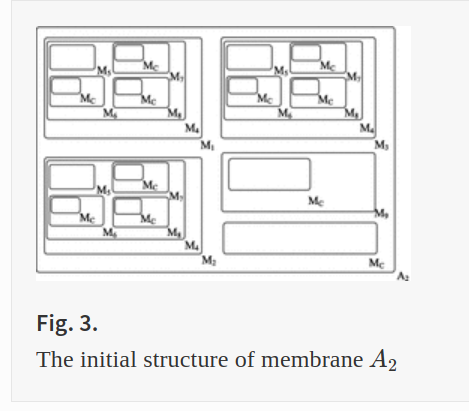
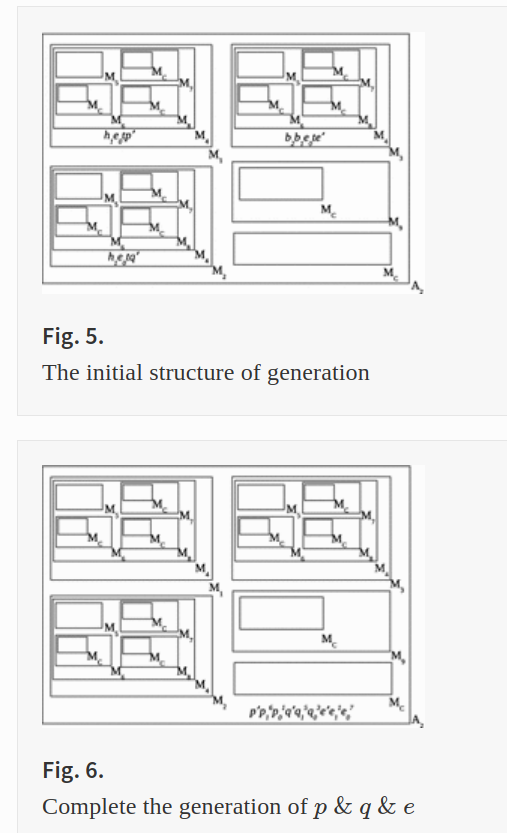

# lit review: membrane computing economics Jan 2022

Springer 

- 82 Result(s) for '"membrane computing" economics model Paun'
- 155 Result(s) for p-system security membrane

excerpts from selections follow

---

# Simulation of reaction systems by the strictly minimal ones

Journal of Membrane Computing volume 2, pages162–170 (2020)

Reaction systems, introduced by Ehrenfeucht and Rozenberg, are elementary computational models based on biochemical reactions transpiring within the living cells. Numerous studies focus on mathematical aspects of minimal reaction systems due to their simplicity and rich generative power. Manzoni et al. (Int J Found Comput Sci 25(4):441–457, 2014) showed that every reaction system can be simulated by some minimal reaction system over an extended background set

If $S$ is any finite set, then the cardinality of $S$ is denoted by $|S|$ and the power set of $S$ is denoted by $2^S$.

A reaction in $S$ is a triple $a=(R_a,I_a,P_a)$, where $R_a$ and $I_a$ are (possibly empty) disjoint subsets of $S$ and $P_a$ is a nonempty subset of $S$. The sets $R_a$, $I_a$, and $P_a$ are the reactant set, inhibitor set, and product set respectively. The pair $(R_a,I_a)$ is the core of $a$.

---

# A Family P System of Realizing RSA Algorithm

International Conference on Bio-Inspired Computing: Theories and Applications
BIC-TA 2016: Bio-inspired Computing – Theories and Applications pp 155-167

Membrane   M4  and its sub membranes are designed to judge whether a number is a prime number, it accepts the multiset a and an object t, and output an object   t1  if the number is a prime number, otherwise output an object   t2 .

---

# A SN P System for Travelling Salesman Problem

International Conference on Human Centered Computing
HCC 2018: Human Centered Computing pp 339-346

The Travelling Salesman Problem is a long-term NP-hard problem that finds the minimum costly Hamiltonian cycles in a weighted undirected graph. 

---

# P System as a Computing Tool for Embedded Feature Selection and Classification Method for Microarray Cancer Data

International Conference on Membrane Computing
CMC 2020: Membrane Computing pp 94-125

membrane computing was applied to improve the efficiency and effectiveness of optimization problems [3], HIV-infection simulations [4], avascular tumor-growth modeling [5], modeling the epidermal growth factor for receptor signaling network [6], quorum-sensing P systems [7], and converting differential-equation models of biological systems to membrane computing [8].

One of the famous embedded methods in cancer classification is SVM-Recursive Feature Elimination (SVM-RFE) [18]. According to Tang et al. [19], SVM-RFE is unstable because it is highly sensitive to f (“filter out" factor), and different f result in significantly different gene subsets, which in turn result in SVM classifiers with significantly different testing accuracies. 

According to Gheorghe et al. [10], A kP system of degree   n  is a tuple,   

$$ kΠ=(O,μ,C_1,...,C_n,i_0) $$

, where  $O$  is a finite set of objects, called an alphabet;   $μ$  defines the membrane structure, which is a graph,   
$(V,E)$
, 
where   $V$  represents vertices indicating compartments, and   $E$  represents edges;   

$$ C_i=(t_i,i) $$

,   $1≤i≤n$ , is a compartment of the system consisting of a compartment type from  $T$  and an initial multiset,  
$ω_i$ , over   $O$ ;   $i_0$  is the output compartment, where the result is obtained (this will not be used in this study). $kP$ systems use a graph-like structure (similar to that of tissue P systems) and two types of rules:

## 1. Rules to process objects: 
these rules are used to transform objects or to move objects inside compartments or between compartments. These types of rules categorize to rewriting, communication, and input-output rules:

- (a) **Rewriting and communication rule**:   
$$x \rightarrow y \left\{ g \right\} $$

, where   $xεA+$ ,   $yεA∗$ ,   
$gεFE(A ∪ A\bar )$

;  $y$  at the right side defines as   

$$y=(a_1,t_1)...(a_h,t_h) $$
.

where   $a_j ε A$  and   $t_j ε L$ ,   $1≤j≤h$ ,   $a_j$  is an object, and   $t_j$  is a target, respectively.

- (b) **The input-output rule**:   

$$(x/y) \left\{ g \right\}$$

, where   $x,yεA∗$ ,   

$$ gεFE(A ∪ A¯)$$ 

, means that   $x$  can be sent from the current compartment to the environment or   $y$  can be brought from the environment to the target compartment.
  
## 2. System structure rules: 
these rules make a fundamental change in the topology of the membranes, for example, with division rule on a compartment, dissolution rule on a specific compartment, make a link between compartments, or dissolve the link between them. These rules are described as follow:

1. **Division rule**:   

$$ [\  ]\ _{li} \rightarrow [\ ]\ 1i_{1},..., [\ ]\ 1i_{n} \left\{ g \right\} $$

, where   gεFE(A∪A¯) ; means compartment   $li$  can be replaced with   n  number of compartments. All newly created compartments inherit objects and links of   $li$ ;
 
2. **Dissolution rule**:  

$$ [\ ]\ 1i \rightarrow λ \left\{ g \right\} $$

means compartment $li$  does not exist anymore as well as all its links with other compartments.
 
1. **Link-creation rule**:   

$$ [\ ]\ 1i; [\ ]\ 1j \rightarrow [\ ]\ 1i^- [\ ]\ 1j \left\{ cg \right\}  $$ 

means a link will be created between compartment   $li$  with compartment  $lj$ . If there is more than one compartment with the label   $lj$ , one of them will have a link with   $lj$  non-deterministically.
 
2. **Link-destruction rule**:   

$$ [\ ]\ 1i^- [\ ]\ 1j \rightarrow [\ ]\ 1i; [\ ]\ 1j \left\{ cg \right\}  $$

means the existence link between   $li$  and $lj$  will eliminate and there will not be any link between them anymore. The same as link creation, if there is more than one compartment that has a link with   $li$ , then one of them will be selected non-deterministically to apply this rule.

multi-objective optimization (MOO) 

---

