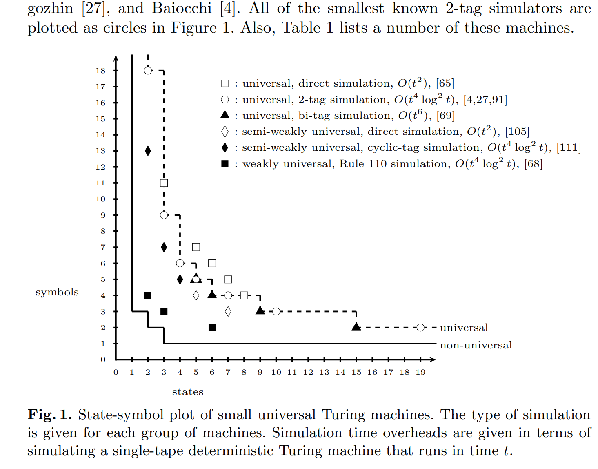
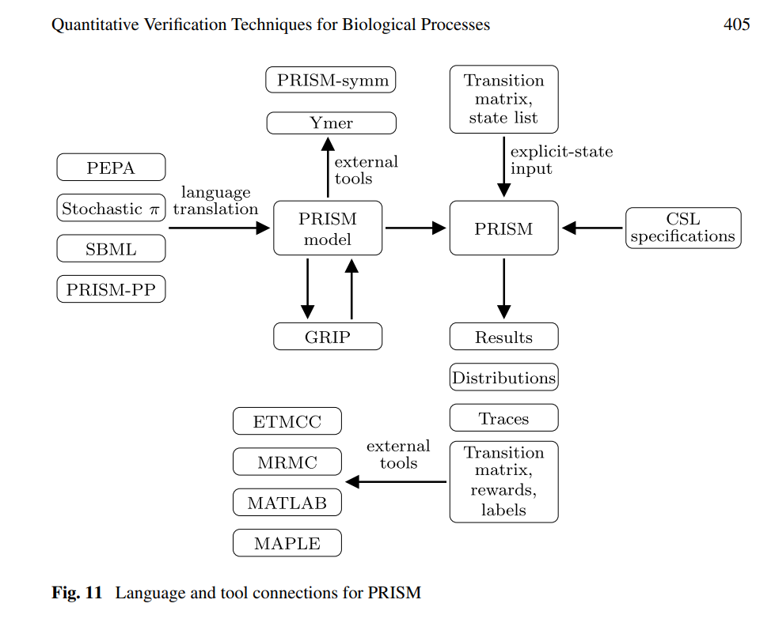
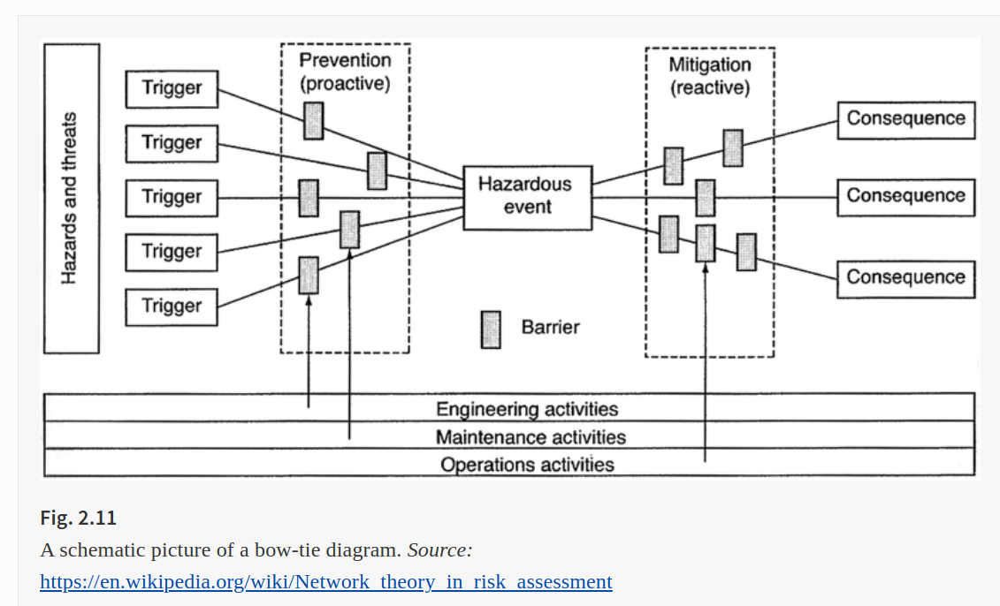

date: 2022 - jan 18

source: springer

658 Result(s) for 'p-system security'

155 Result(s) for 'p-system security membrane'

---

# The Complexity of Small Universal Turing Machines: A Survey

International Conference on Current Trends in Theory and Practice of Computer Science
SOFSEM 2012: SOFSEM 2012: Theory and Practice of Computer Science pp 385-405

In 1956 Shannon [95] considered the question of finding the smallest possible
universal Turing machine [99], where size is the number of states and symbols.

In the early Sixties, Minsky and Watanabe had a running competition to see
who could find the smallest universal Turing machine [51,54,103,104]. Early attempts [23,104] gave small universal Turing machines that efficiently (in polynomial time) simulated Turing machines. In 1962, Minsky [54] found a small
7-state, 4-symbol universal machine. 

**Rule 110** is an elementary cellular automaton, which means that it is a one-dimensional, nearest neighbour, 
binary cellular automaton [106]. More precisely, it is composed of a sequence of cells $...p_−1p_0p_1...$ where each cell has a binary state $p_i ∈ {0, 1}$. At timestep
t + 1 the value of cell 

$$ p_{i,t+1} = F(p_{i−1,t}, p_{i,t}, p_{i+1,t}) $$

is given by the synchronous local update function F

$$ F(0, 0, 0) = 0   \hspace{2em}    F(1, 0, 0) = 0  \\
F(0, 0, 1) = 1 \hspace{2em}         F(1, 0, 1) = 1  \\
F(0, 1, 0) = 1 \hspace{2em}         F(1, 1, 0) = 1  \\
F(0, 1, 1) = 1 \hspace{2em}         F(1, 1, 1) = 0  \\
$$

---

# Quantitative Verification Techniques for Biological Processes

Algorithmic Bioprocesses pp 391-409

The kinetic rates given in Fig. 3 are based on the data presented in [15] where
it is assumed that the Km values (Km = (dm + km)/am) for phosphorylation and
dephosphorylation of MAPK, MAPKK, and MAPKKK all equal 300 nM.

---

# Causal Concepts, Principles, and Algorithms

Causal Analytics for Applied Risk Analysis pp 97-247

Perhaps the simplest intuition relating probability and causation is that causes make their effects more probable.

$$ P\left(x,y\right)=P(y)P\left(x|y\right) $$ 

$$  P\left(x,y\right)=P(x)P\left(y|x\right) $$

$$ P(y)P\left(x|y\right)=P(x)P\left(y|x\right) $$

$$ P\left(x|y\right)=P(x)P\left(y|x\right)/P(y) $$

**bayes rule**

$$ P\left(x|y\right)=P(x)P\left(y|x\right)/{\sum}_{x^{\prime }}P\left(y|{x}^{\prime}\right)P\left({x}^{\prime}\right) $$ 

Such a query-answering system, returning answers of the form P(query | data), could potentially be useful for many applications, including the following, among very many others:

- Medical diagnosis, quantifying P(disease | symptoms);

- Fault diagnosis systems, quantifying P(fault_condition | test_results) for electronic equipment;

- Credit scores quantifying P(repayment | credit_history);

- Forecasts quantifying P(future_value | history). Special cases include weather forecasts such as P(rain_tomorrow | observations) or hurricane predictions, agricultural forecasts, economic forecasts, and many others.

- Reliability models quantifying P(system will survive for > T more years | current age and condition);

- Predictive toxicology models quantifying P(adverse_response | exposure) or P(chemical is a mutagen | chemical properties)

- Mineral prospecting expert systems quantifying P(ore grade | observations)

BN software products and methods allow the following standard approach to formulating and solving probabilistic inference problems for BNs with any number of nodes.

1. Create a BN consisting of a node for each random variable and a DAG (directed acyclic graph ) in which arrows between variables represent dependencies between them.

 
2. Specify a marginal probability distribution for each input node.

 
3. Specify a CPT for each node with an arrow pointing into it.

 
4. Enter observations or assumptions (sometimes referred to generically as “findings”) about the values of some of the variables.

 
5. Obtain the conditional (posterior) distributions of all other variables, conditioned on the findings entered by the user. BN solver software packages automatically calculate these updated distributions.

The general pattern illustrated by the foregoing example, in which conditioning on a common effect (or, in less suggestive language, a common child or descendant in a DAG) induces statistical dependencies among their parents or ancestors, has been discussed under different names in epidemiology, including selection bias, collider stratification bias, and Berkson’s bias (Cole et al. 2010; Westreich 2012). A practical implication is that statistic modeling can inadvertently create significant associations and dependencies between variables that are not causally related, or even associated with each other in the absence of conditioning on other variables. Either of the following two common research situations can create such non-causal statistical associations:

- A study design that selects a certain population for investigation, such as an occupational cohort, a population of patients in a specific hospital or health insurance plan, or residents in a certain geographic area. If the dependent variable of interest and an explanatory variable of interest both affect membership in the selected study population, then selection bias might create spurious (meaning non-causal) associations between them.

- A statistical analysis, such as regression modeling, which stratifies or conditions on the observed values of some explanatory variables.

Non-causal explanations for observed associations, and methods to overcome them

- Source of non-causal association
- Methods for overcoming non-causal associations

**Unobserved (latent) confounders**

These can be tested for and their effects modeled using the Tetrad, Invariant Causal Prediction, and BACKSHIFT algorithms, among others

**Spurious regression in time series or spatial observations with trends**

Spurious regression arising from coincident trends can be detected and avoided by using conditional independence tests and predictive causation (e.g., Granger causality) instead of regression models

**Collider bias ; stratification or selection bias**

A study that stratifies or matches individuals on certain variables, such as membership in an occupation, or an analysis that conditions on certain variables by including them on the right-hand side of a regression model, can induce exposure-response associations if the variables conditioned, matched, or stratified on are common descendents of the exposure and response variables. The association does not indicate causality between exposure and response, but that they provide alternative explanations of an observed value. Such biases can be avoided by using DAGitty to compute adjustment sets and conditioning only on variables in an adjustment set

**Other threats to internal validity**

Threats to internal validity (e.g., regression to the mean) were enumerated by Campbell and Stanley (1963), who also discuss ways to refute them as plausible explanations, when possible, using observational data

**Model specification errors**

Model specification errors arise when an analysis assumes a particular parametric modeling form that does not accurately describe the data-generating process. Assuming a linear regression model when there are nonlinear effects present is one example; omitting high-order interactions terms is another. Model specification errors can be avoided by using non-parametric model ensemble methods such as PDPs

**P-hacking, i.e., adjusting modeling assumptions to produce an association (e.g., a statistically significantly positive regression coefficient)**

Automated modeling using CAT or packages such as randomForest and bnlearn to automate modeling choices such as which predictors to select, how to code them (i.e., aggregate their values into ranges), and which high-order interactions to include can help to avoid p-hacking biases

**Omitted errors in explanatory variables**

Using job exposure matrices, remote-sensing and satellite imagery for pollutant concentration estimation, or other error-prone techniques for estimating exposures, creates exposure estimates for individuals that can differ substantially from their true exposures. In simple regression models, omitting errors from the estimated values of explanatory variables tends to bias regression coefficients toward the null (i.e., 0), but the bias can be in either direction in multivariate models, and failing to carefully model errors in explanatory variables can create false-positive associations

**Omitted interdependencies among explanatory variables**

Direct and total effects of exposure on response can have opposite signs. More generally, the DAG model in which variables are embedded can create associations without causation in a regression model that includes on its right-hand side variables not in an adjustment set. This can be avoided by using DAGitty to compute adjustment sets for the total causal effect of exposure on response and then to condition on variables in an adjustment set to estimate that effect

---

# A Metabolic Approach to Protocol Resilience

Workshop on Autonomic Communication
WAC 2004: Autonomic Communication pp 191-206

Autonomic Communication [1] is a long-term research initiative aimed at the
study of the self-organization of network elements, toward their autonomous behavior and automated evolvability. Autonomic networks must be self-managing,
which includes self-monitoring and self-healing, among other self-* properties.
Several areas are concerned, including security, trust, stability, resilience, control,
programmability, behavior composition, and context awareness.
Two important and complementary goals of autonomic communication are
resilience and self-healing capacity: resilience against internal failures and misbehavior, and self-healing ability to recover from such abnormal conditions.

Robustness to link or node failure is generally achieved by rerouting traffic
to alternative paths. In OSPF (Open Shortest Path First), node or link failures
are detected via link advertisement messages, and new routes are recomputed
accordingly. In BGP (Border Gateway Protocol), as well as in MPLS (MultiProtocol Label Switching) route restoration is achieved via backup paths, such
that service can be preserved during failure of the main path.

Core Wars
Finally we mention “core wars” [19]: Two programs, which share the same random access (core) memory, struggle for survival by attacking the other program
through tampering with its instructions and/or by evading attacks through dislocation. Various robustness and self-healing strategies have been proposed for
this rather specific context and the associated virtual machine.

---

# A New Communication P System Model Based on Hypergraph

International Conference on Human Centered Computing
HCC 2018: Human Centered Computing pp 130-142

Through the simulation of the register machine, the computational completeness of the hypergraph P system is proved.

**vicinal membrance**:   m,m′  are vicinal only if   m′⊂m  and there is no   m′′  like   m′⊂m′′⊂m . 

**skin membrane**: there is an unique skin membrane in each membrane system, and the skin membrane has no upper vicinal membranes. 

**elementary membrane**: the elementary membrane has no lower vicinal membranes. 

**district in membrane**: This concept is pretty obvious to the elementary membrane, but for other kind of membrane, the district refers in particular to the space between the membrane and its nearest vicinal membrance. degree: number of membranes; sibling membranes   m,m′ : if   m′′  is a common upper vicinal for both m and   m′ .

A P system based on a hypergraph H, called a hypergraph P system, with antiport and symport rules is a construct
Π=(m,O,T,C,H,Ewi,ω1,…,ωm,A(i,j)((R1ρ1),…,(Rmρm)),i0)
m is the degree of membrane,
O is the alphabet, the elements of it is called objects,

T⊂O  is the alphabet of terminal objects,

C⊂O−T  is the catalyst, the elements of it do not change during evolution and do not produce new characters, but some evolutionary rules must have its participation,

H=(V,E) , V is the set of the vertices and E is a set of hyperedges. H represents the relationships between membranes of the hypergraph P system,

Ewi  is the weight of membrance i, the default value is 1,

ω1,…,ωm  are the multisets of objects contained by the region i of membrane structure,

A(i, j) is the accessible matrix to the membrances (edges),

((R1ρ1),…,(Rmρm))  are finite sets of symport and antiport rules,   Ri(i=1,…,m)  is associated with the m membranes,   ρ  is the partial ordering relationship of the rules R, which is called the priority relation.   ρ  indicates the priority order of the execution of rules R,

i0  is the input/output mark of membrance.

If rules are totally ordered as   r1>r2…>rn>rn+1>… . Only the system has reached a stable configuration with respect to the rule   rn  can the rule   rn+1  start application.
