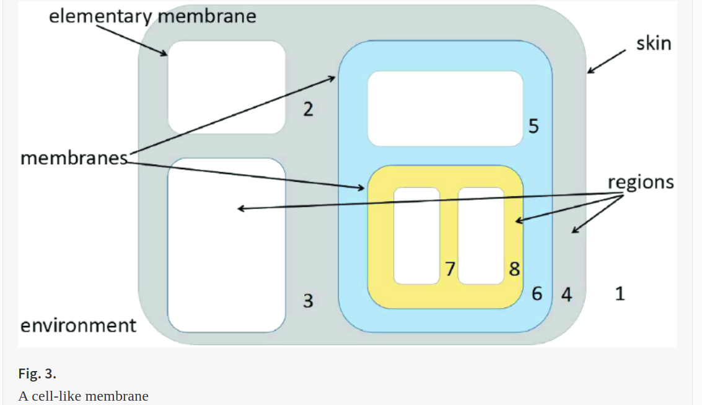

date: 2022 - jan 18

source: springer

658 Result(s) for 'p-system security'

155 Result(s) for 'p-system security membrane'

---

# A New Communication P System Model Based on Hypergraph

International Conference on Human Centered Computing
HCC 2018: Human Centered Computing pp 130-142

Through the simulation of the register machine, the computational completeness of the hypergraph P system is proved.

**vicinal membrance**:   m,m′  are vicinal only if   m′⊂m  and there is no   m′′  like   m′⊂m′′⊂m . 

**skin membrane**: there is an unique skin membrane in each membrane system, and the skin membrane has no upper vicinal membranes. 

**elementary membrane**: the elementary membrane has no lower vicinal membranes. 

**district in membrane**: This concept is pretty obvious to the elementary membrane, but for other kind of membrane, the district refers in particular to the space between the membrane and its nearest vicinal membrance. degree: number of membranes; sibling membranes   m,m′ : if   m′′  is a common upper vicinal for both m and   m′ .

A P system based on a hypergraph H, called a hypergraph P system, with antiport and symport rules is a construct
Π=(m,O,T,C,H,Ewi,ω1,…,ωm,A(i,j)((R1ρ1),…,(Rmρm)),i0)
m is the degree of membrane,
O is the alphabet, the elements of it is called objects,

T⊂O  is the alphabet of terminal objects,

C⊂O−T  is the catalyst, the elements of it do not change during evolution and do not produce new characters, but some evolutionary rules must have its participation,

H=(V,E) , V is the set of the vertices and E is a set of hyperedges. H represents the relationships between membranes of the hypergraph P system,

Ewi  is the weight of membrance i, the default value is 1,

ω1,…,ωm  are the multisets of objects contained by the region i of membrane structure,

A(i, j) is the accessible matrix to the membrances (edges),

((R1ρ1),…,(Rmρm))  are finite sets of symport and antiport rules,   Ri(i=1,…,m)  is associated with the m membranes,   ρ  is the partial ordering relationship of the rules R, which is called the priority relation.   ρ  indicates the priority order of the execution of rules R,

i0  is the input/output mark of membrance.

If rules are totally ordered as   r1>r2…>rn>rn+1>… . Only the system has reached a stable configuration with respect to the rule   rn  can the rule   rn+1  start application.
