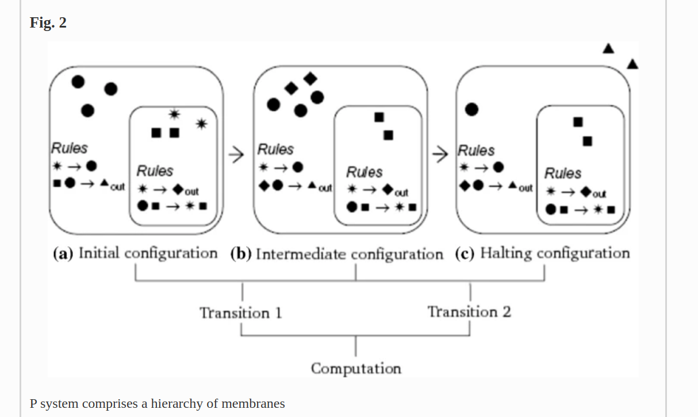
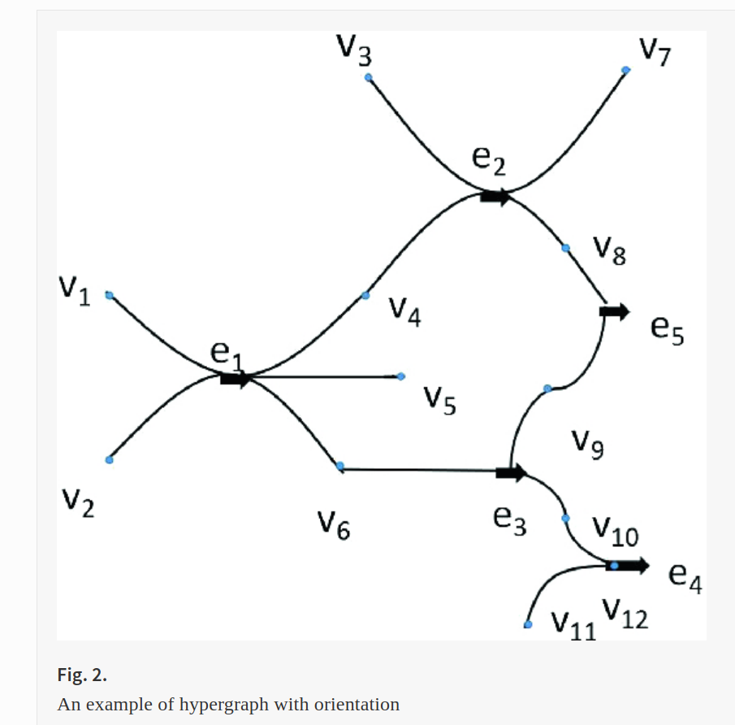

date: 2022 - jan 18

source: springer

658 Result(s) for 'p-system security'

155 Result(s) for 'p-system security membrane'

---

# Integrated Membrane Computing Framework for Modeling Intrusion Detection Systems

International Conference on Bio-Inspired Computing: Theories and Applications
BIC-TA 2016: Bio-inspired Computing – Theories and Applications pp 336-346

two of the models were evaluated using KDD Cup dataset.

---

# Membrane computing inspired protocol to enhance security in cloud network

The Journal of Supercomputing volume 75, pages2181–2192 (2019)

---

# Formal verification of cP systems using Coq

Journal of Membrane Computing volume 3, pages205–220 (2021)

cP systems share the fundamental features of cell-like [1] and tissue P systems [3]. Membranes and objects in a top-level cell are represented as labelled nested multiset-based terms, and top-level cells can be organized in graph networks. Each top-level cell has evolution rules, and sub-cells are only used to represent local data. Different from most of P system variants, evolution rules in cP systems are generic, and contain first-order variables

---

# Formal verification of cP systems using PAT3 and ProB

Journal of Membrane Computing volume 2, pages80–94 (2020)

The first version of Process Analysis Toolkit (PAT) model checker was proposed in 2008 [38], which aimed to analyze event-based compositional systems. CSP# is a model checking language extended from the Communicating Sequential Processes (CSP) formal notation. It is used in PAT model checker to describe system specifications and provide refinement checking, Linear Temporal Logic (LTL) checking and system simulation. A fully automatic approach on checking fairness properties using PAT was presented later by Sun et al. [40]. The second main release of PAT was focused on handling system analysis under fairness [39]. The latest version of PAT is PAT3, which has a four-layer structure: modeling layer, abstraction layer, intermediate representation layer and analysis layer. The four layers contain domain-specific components, abstraction and reduction techniques, semantic models and model checking algorithms, respectively [26]. PAT3 can be extended with custom modeling languages, model checking algorithms and reduction techniques.

---

# A Faster P Solution for the Byzantine Agreement Problem

International Conference on Membrane Computing
CMC 2010: Membrane Computing pp 175-197

Exponential Information Gathering (EIG) trees

An Exponential Information Gathering (EIG) tree $T_{N,L}$, $N ≥ L ≥ 0$, is a labelled
(ordered) rooted tree of height $L$ that is defined recursively as follows. The tree $T_{N,0}$
is a rooted tree with just one node, its root, labelled $λ$. For $L ≥ 1$, $T_{N,L}$ is a rooted
tree with $1 + N|T_{N−1,L−1}|$ nodes (where $|T|$ is the size of tree $T$ ), root $λ$, having $N$
subtrees, where each subtree is isomorphic with $T_{N−1,L−1}$ and each node, except the
root, is labelled by the least element of $[1, N]$ that is different from any ancestor node
or any left sibling node. Alternatively, $T_{N,L−1} is isomorphic and identically labelled
with the tree obtained from $T_{N,L}$ by deleting all its leaves. It is straightforward to see
that there is a bijective correspondence between the permutations of $P(N,L)$ and the
sequences (concatenations) of labels on all paths from root to the leaves of $T_{N,L}$. Thus,
each node $σ$ in an EIG tree $T_{N,L}$ is uniquely identified by a permutation $πσ ∈ P(N,l)$,
where $l ∈ [0, L]$ is also $σ$’s depth, and, vice-versa, each such permutation π has a
corresponding node $σπ$.

Besides objects of the initial alphabet, rules can also use generic symbols. A generic
symbol, abbreviated as sym, can be instantiated to one of the already existing objects or as a new object (thereby extending the initial alphabet).
– Cells can be designated as external definitions. An external definition indicates either the start or the end of a potential arc and is abbreviated as $def_↑$ or as $def_↓$,
respectively.
– Arcs can be designated as external arcs, indicating potential arcs between existing
cells and external definitions of other modules. An external arc has one uninstantiated start or end cell, called an external reference, which is abbreviated as $ref_↑$ or
as $ref_↓$, respectively.
– An external arc can be instantiated by identifying its external reference to a matching external definition from another module, i.e. either its $ref_↓$ reference to a $def_↓$
definition, or its $ref_↑$ reference to a $def_↑$ definition.

## Definition 1 (P module). 
A $P$ module is a system $Π = (O, K, δ, S, D_↑, D_↓, R_↑, R_↓)$,
where:
1. $O$ is a finite non-empty alphabet of objects;
2. $K$ is a finite set of cells;
3. $δ$ is a subset of $(K × K) ∪ (K × R_↓) ∪ (R_↑ × K)$, i.e. a set of parent-child
structural arcs, representing duplex or simplex communication channels, between
two existing cells or between an existing cell and an external reference;
4. $S$ is a finite alphabet, disjoint of $O$, of generic sym objects;
5. $D_↑$ is a subset of $K$, representing $def_↑$ definitions;
6. $D_↓$ is a subset of $K$, representing $def_↓$ definitions;
7. $R_↑$ is a finite set, disjoint of $K$, representing $ref_↑$ references;
8. $R_↓$ is a finite set, disjoint of $K$, representing $ref_↓$ references.

Let $O¯ = O ∪ S$ be the original alphabet extended with the generic symbols. Each cell,
$σ ∈ K$, has the form $σ = (Q,s0, w0, R)$, where:
– $Q$ is a finite set of states;
– $s_0 ∈ Q$ is the initial state;
– $w_0 ∈ O¯∗$ is the initial multiset of objects;
– $R$ is a finite ordered set of multiset rewriting rules of the general form: 

$$s x →α s x (u)βγ $$

, where $s, s ∈ Q$, $x$, $x ∈ O¯∗$, $u ∈ O¯∗$, $α ∈ {min, max}$, $β ∈ {↑
, ↓, !, ↔}$, $γ ∈ {one, spread, repl} ∪ K ∪ R_↑ ∪ R_↓$. If $u = λ$, this rule can be
abbreviated as $s x →α s x$
. The semantics of the rules and of the $α$, $β$, $γ$ operators
are further described in the rest of this section.

---

# An Analysis of a Public Key Protocol with Membranes

Applications of Membrane Computing pp 283-302

MGS

MGS embeds a complete, impure, dynamically typed, strict, functional language. We describe here only the major differences between the constructions available in MGS with respect to functional languages like OCAML [15] or
HASKELL [12].

---

# A Membrane Algorithm to Stabilize a Distributed Computing System

International Conference on Contemporary Computing
IC3 2011: Contemporary Computing pp 16-28

the algorithm successfully
stabilizes the system on the event of arbitrary failure (i.e. lysis, in biological terms) of
the nodes or on self-detection of network partitions. The distinguishing features of the
algorithm are, (a) self-detection of lysis and transformation and, (b) self-stabilization
of the system

It is important to note that the outermost membrane of a cell (skin c1) never
dissolves. However, the intra-cellular membranes may be dissolved at any time
exposing the corresponding intra-structural cellular matrix to the exterior matrix of
the cytoplasm of the cell. Translating the cellular model into computing domain, the
skin is numerically numbered as one (1) and the other intra-cellular membranes are
numerically numbered distinctly as illustrated in Figure 1. There exists a set of
evolution rules within each region of the cytoplasm and the rules control the ongoing
computation of the corresponding region bounded by the membranes. The
numerically numbered membrane structure can be conceptually represented as a tree
in the domain of computing systems [6]. The spanning-tree representation of cellular
membranes is illustrated in Figure 2.

---

# Comparative Analysis of Statistical Model Checking Tools

International Conference on Membrane Computing
CMC 2016: Membrane Computing pp 119-135

To overcome the state-space explosion problem, the statistical model checking (SMC) approach does not analyse the entire state space, but instead generates a number of independent simulation traces and uses statistical (e.g., Monte Carlo) methods to generate an approximate measure of system correctness. This approach does not guarantee the absolute correctness of the system, but it allows much larger models be verified (within specified confidence limits) in a faster manner [12, 35, 47, 49]. This approach allows verifying much larger models with significantly improved performance.

---

# An efficient labelled nested multiset unification algorithm

Journal of Membrane Computing volume 3, pages194–204 (2021)

Similar to the term definition in cP systems [2], we consider functors as labels of multisets. For example: f(abc) is a multiset labelled with f, which contains three atom a, b, and c. Similarly, f(g(h)) is a multiset labelled with f, which contains a submultiset with label g, which contains an atom h. Thus, the order of “parameters” of a functor does not matter. For instance, both f(aab) and f(baa) represent a multiset labelled with f, which contains three atoms a, a, and b.

---

# Proximity-Based Federation of Smart Objects: Liberating Ubiquitous Computing from Stereotyped Application Scenarios

International Conference on Knowledge-Based and Intelligent Information and Engineering Systems
KES 2010: Knowledge-Based and Intelligent Information and Engineering Systems pp 14-30

Such formal computation models of process calculi include Chemical Abstract Machine [3],
Mobile Ambients [4], P-Systems [5], Bigraphical Reactive System [6], Seal Calculus [7], Kell Calculus [8], and LMNtal [9].

Here we use the term ‘federation’ to denote the
definition and execution of interoperation among resources that are accessible either
through the Internet or through peer-to-peer ad hoc communication. This term was
probably first introduced to IT areas by Dennis Heimbigner in the context of a federated database architecture [13], and then secondarily in late 90s, by Bill Joy in a different context, namely, federation of services [14]. Federation is different from integration
in which member resource objects involved are assumed to have previously designed
standard interoperation interface.

A collectively autocatalytic set is a network of catalytic
reactions in which a product of each reaction may work as a source material of another reaction or as a catalyst to enhance or to repress another reaction. Each reaction
is either a composition to produce a compound product from more primitive source
materials, or a decomposition to decompose a source material into its component
materials. 

---

# On the Teaching Complexity of Linear Sets

International Conference on Algorithmic Learning Theory
ALT 2015: Algorithmic Learning Theory pp 102-116

Prior work has investigated the learnability of linear sets and semilinear sets in three models – Valiant’s PAC-learning model, Gold’s learning in the limit model, and Angluin’s query learning model.

A linear set L is defined by a nonnegative lattice point (called a constant) and
a finite set of nonnegative lattice sets (called periods); the members of L are
generated by adding to the constant an arbitrary finite sequence of the periods
(allowing repetitions of the same period in the sequence). A semilinear set is a
finite union of linear sets. Semilinear sets are not only objects of mathematical
interest, but have also been linked to finite-state machines and formal languages.
One of the earliest and most important results on the connection between semilinear sets and context-free languages is Parikh’s theorem [9], which states that
any context-free language is mapped to a semilinear set via a function known as
the Parikh vector of a string. Another interesting result, due to Ibarra [6], characterises semilinear sets in terms of reversal-bounded multicounter machines.
Moving beyond abstract theory, semilinear sets have also recently been applied
in the fields of DNA self-assembly [3] and membrane computing [7].

---

# Computational Thinking in Biology

Transactions on Computational Systems Biology VIII pp 63-76

---

# Robustness in Nature as a Design Principle for Artificial Intelligence

Robust Intelligent Systems pp 164-186

a robust system is a system that tolerates faults

---

# The Contribution of Theoretical Chemistry to the Drug Design in Photodynamic Therapy

Photosensitizers in Medicine, Environment, and Security pp 121-134 

(a false positive for our search terms but interesting nonetheless)

The possibility to design new photosensitizers active in photodynamic therapy starting from computed chemical physics electronic and geometrical properties by using the density functional theory is presented. In particular, we were concerned with the porphyrin-like systems able to activate the singlet O2 excited state (Type II reactions). The investigated properties include the energy gap between ground and excited states with different spin multiplicities (Singlet-Triplet) and the electronic excitation energies (Q band of the UV-Vis spectra).

The practical clinical cycle include the following steps:

1. a non toxic photosensitizer is introduced in the body of the appropriate target;
 
2. the target is irradiated with light of appropriate wavelength, ranging from 600 to 900 nm (the so-called therapeutic window), in order to excite the photosensitizer from its ground state (S0) to a shorter-lived first excited state (S1);
 
3. S1 can undergo conversion to the first excited triplet state (T1) by intersystem crossing. Then the T1 state of the sensitizer can release its energy to the surrounding biological tissue exciting the O2 from its triplet to the highly reactive singlet state that induces an oxidative cellular damage leading the apoptosis or necrosis of the cells;
 
4. finally, the photosensitizer returns to its ground state and the cycle can be repeated with a new light irradiation. At the end of the therapeutic cycle the sensitizer is eliminated from the body.

---

# The Complexity of Small Universal Turing Machines: A Survey

International Conference on Current Trends in Theory and Practice of Computer Science
SOFSEM 2012: SOFSEM 2012: Theory and Practice of Computer Science pp 385-405

In 1956 Shannon [95] considered the question of finding the smallest possible
universal Turing machine [99], where size is the number of states and symbols.

In the early Sixties, Minsky and Watanabe had a running competition to see
who could find the smallest universal Turing machine [51,54,103,104]. Early attempts [23,104] gave small universal Turing machines that efficiently (in polynomial time) simulated Turing machines. In 1962, Minsky [54] found a small
7-state, 4-symbol universal machine. 

**Rule 110** is an elementary cellular automaton, which means that it is a one-dimensional, nearest neighbour, 
binary cellular automaton [106]. More precisely, it is composed of a sequence of cells $...p_−1p_0p_1...$ where each cell has a binary state $p_i ∈ {0, 1}$. At timestep
t + 1 the value of cell 

$$ p_{i,t+1} = F(p_{i−1,t}, p_{i,t}, p_{i+1,t}) $$

is given by the synchronous local update function F

$$ F(0, 0, 0) = 0   \hspace{2em}    F(1, 0, 0) = 0  \\
F(0, 0, 1) = 1 \hspace{2em}         F(1, 0, 1) = 1  \\
F(0, 1, 0) = 1 \hspace{2em}         F(1, 1, 0) = 1  \\
F(0, 1, 1) = 1 \hspace{2em}         F(1, 1, 1) = 0  \\
$$

Langton’s ant [29] is usually described as an ant that lives on a 2D grid of
binary-valued cells. The ant chooses which adjacent cell to move to based on
(a) the current cell’s binary value and (b) the ant’s current orientation. The ant
flips the current cell’s bit as it moves away. So Langton’s ant is a 2D Turing
machine with 2 symbols and 4 states (North, South, East and West).

There are many ways
to define terminal configuration sequence, some examples are:
– a configuration sequence that goes through a specified sequence of states,
– a configuration sequence that contains two identical configurations,
– a configuration that contains a specific subword

The term busy beaver was introduced by
Rado [83] who put forward a game where the goal for a given $k ∈ N$ is to find,
out of all the k-state, 2-symbol Turing machines, the machine that prints the
most 1s and then halts when started on a blank tape. The busy beaver function
$Σ : N \rightarrow N$ is then defined by letting $Σ(k)$ be the maximum number of 1’s printed
by any halting k-state, 2-symbol Turing machine. Busy beavers essentially adhere to the standard Turing machine model described in previous sections (one
tape, one head, usual blank symbol, deterministic). It is known that $Σ(1) = 1$
(trivial), $Σ(2) = 4$ [83], $Σ(3) = 6$ [30], and $Σ(4) = 13$ [6]. However for 5 states
or more the best we currently have are lower bounds. For example, Michel [50]
cites $Σ(5) ≥ 4098$ to Marxen and Buntrock [47], and $Σ(6) ≥ 3.5 × 1018267$ to
Pavel Kropitz. $S(k)$, the step-counting analogue of $Σ(k)$, is also considered. In
fact, both $Σ$ and $S$ grow faster than any computable function [83]. Green [16]
has given a lower bound on the growth of the function $Σ$.

---

# Quantitative Verification Techniques for Biological Processes

Algorithmic Bioprocesses pp 391-409

The kinetic rates given in Fig. 3 are based on the data presented in [15] where
it is assumed that the Km values (Km = (dm + km)/am) for phosphorylation and
dephosphorylation of MAPK, MAPKK, and MAPKKK all equal 300 nM.

---

# Causal Concepts, Principles, and Algorithms

Causal Analytics for Applied Risk Analysis pp 97-247

Perhaps the simplest intuition relating probability and causation is that causes make their effects more probable.

$$ P\left(x,y\right)=P(y)P\left(x|y\right) $$ 

$$  P\left(x,y\right)=P(x)P\left(y|x\right) $$

$$ P(y)P\left(x|y\right)=P(x)P\left(y|x\right) $$

$$ P\left(x|y\right)=P(x)P\left(y|x\right)/P(y) $$

**bayes rule**

$$ P\left(x|y\right)=P(x)P\left(y|x\right)/{\sum}_{x^{\prime }}P\left(y|{x}^{\prime}\right)P\left({x}^{\prime}\right) $$ 

Such a query-answering system, returning answers of the form P(query | data), could potentially be useful for many applications, including the following, among very many others:

- Medical diagnosis, quantifying P(disease | symptoms);

- Fault diagnosis systems, quantifying P(fault_condition | test_results) for electronic equipment;

- Credit scores quantifying P(repayment | credit_history);

- Forecasts quantifying P(future_value | history). Special cases include weather forecasts such as P(rain_tomorrow | observations) or hurricane predictions, agricultural forecasts, economic forecasts, and many others.

- Reliability models quantifying P(system will survive for > T more years | current age and condition);

- Predictive toxicology models quantifying P(adverse_response | exposure) or P(chemical is a mutagen | chemical properties)

- Mineral prospecting expert systems quantifying P(ore grade | observations)

BN software products and methods allow the following standard approach to formulating and solving probabilistic inference problems for BNs with any number of nodes.

1. Create a BN consisting of a node for each random variable and a DAG (directed acyclic graph ) in which arrows between variables represent dependencies between them.

 
2. Specify a marginal probability distribution for each input node.

 
3. Specify a CPT for each node with an arrow pointing into it.

 
4. Enter observations or assumptions (sometimes referred to generically as “findings”) about the values of some of the variables.

 
5. Obtain the conditional (posterior) distributions of all other variables, conditioned on the findings entered by the user. BN solver software packages automatically calculate these updated distributions.

The general pattern illustrated by the foregoing example, in which conditioning on a common effect (or, in less suggestive language, a common child or descendant in a DAG) induces statistical dependencies among their parents or ancestors, has been discussed under different names in epidemiology, including selection bias, collider stratification bias, and Berkson’s bias (Cole et al. 2010; Westreich 2012). A practical implication is that statistic modeling can inadvertently create significant associations and dependencies between variables that are not causally related, or even associated with each other in the absence of conditioning on other variables. Either of the following two common research situations can create such non-causal statistical associations:

- A study design that selects a certain population for investigation, such as an occupational cohort, a population of patients in a specific hospital or health insurance plan, or residents in a certain geographic area. If the dependent variable of interest and an explanatory variable of interest both affect membership in the selected study population, then selection bias might create spurious (meaning non-causal) associations between them.

- A statistical analysis, such as regression modeling, which stratifies or conditions on the observed values of some explanatory variables.

Non-causal explanations for observed associations, and methods to overcome them

- Source of non-causal association
- Methods for overcoming non-causal associations

**Unobserved (latent) confounders**

These can be tested for and their effects modeled using the Tetrad, Invariant Causal Prediction, and BACKSHIFT algorithms, among others

**Spurious regression in time series or spatial observations with trends**

Spurious regression arising from coincident trends can be detected and avoided by using conditional independence tests and predictive causation (e.g., Granger causality) instead of regression models

**Collider bias ; stratification or selection bias**

A study that stratifies or matches individuals on certain variables, such as membership in an occupation, or an analysis that conditions on certain variables by including them on the right-hand side of a regression model, can induce exposure-response associations if the variables conditioned, matched, or stratified on are common descendents of the exposure and response variables. The association does not indicate causality between exposure and response, but that they provide alternative explanations of an observed value. Such biases can be avoided by using DAGitty to compute adjustment sets and conditioning only on variables in an adjustment set

**Other threats to internal validity**

Threats to internal validity (e.g., regression to the mean) were enumerated by Campbell and Stanley (1963), who also discuss ways to refute them as plausible explanations, when possible, using observational data

**Model specification errors**

Model specification errors arise when an analysis assumes a particular parametric modeling form that does not accurately describe the data-generating process. Assuming a linear regression model when there are nonlinear effects present is one example; omitting high-order interactions terms is another. Model specification errors can be avoided by using non-parametric model ensemble methods such as PDPs

**P-hacking, i.e., adjusting modeling assumptions to produce an association (e.g., a statistically significantly positive regression coefficient)**

Automated modeling using CAT or packages such as randomForest and bnlearn to automate modeling choices such as which predictors to select, how to code them (i.e., aggregate their values into ranges), and which high-order interactions to include can help to avoid p-hacking biases

**Omitted errors in explanatory variables**

Using job exposure matrices, remote-sensing and satellite imagery for pollutant concentration estimation, or other error-prone techniques for estimating exposures, creates exposure estimates for individuals that can differ substantially from their true exposures. In simple regression models, omitting errors from the estimated values of explanatory variables tends to bias regression coefficients toward the null (i.e., 0), but the bias can be in either direction in multivariate models, and failing to carefully model errors in explanatory variables can create false-positive associations

**Omitted interdependencies among explanatory variables**

Direct and total effects of exposure on response can have opposite signs. More generally, the DAG model in which variables are embedded can create associations without causation in a regression model that includes on its right-hand side variables not in an adjustment set. This can be avoided by using DAGitty to compute adjustment sets for the total causal effect of exposure on response and then to condition on variables in an adjustment set to estimate that effect

---

# A Metabolic Approach to Protocol Resilience

Workshop on Autonomic Communication
WAC 2004: Autonomic Communication pp 191-206

Autonomic Communication [1] is a long-term research initiative aimed at the
study of the self-organization of network elements, toward their autonomous behavior and automated evolvability. Autonomic networks must be self-managing,
which includes self-monitoring and self-healing, among other self-* properties.
Several areas are concerned, including security, trust, stability, resilience, control,
programmability, behavior composition, and context awareness.
Two important and complementary goals of autonomic communication are
resilience and self-healing capacity: resilience against internal failures and misbehavior, and self-healing ability to recover from such abnormal conditions.

Robustness to link or node failure is generally achieved by rerouting traffic
to alternative paths. In OSPF (Open Shortest Path First), node or link failures
are detected via link advertisement messages, and new routes are recomputed
accordingly. In BGP (Border Gateway Protocol), as well as in MPLS (MultiProtocol Label Switching) route restoration is achieved via backup paths, such
that service can be preserved during failure of the main path.

Core Wars
Finally we mention “core wars” [19]: Two programs, which share the same random access (core) memory, struggle for survival by attacking the other program
through tampering with its instructions and/or by evading attacks through dislocation. Various robustness and self-healing strategies have been proposed for
this rather specific context and the associated virtual machine.

---

# A New Communication P System Model Based on Hypergraph

International Conference on Human Centered Computing
HCC 2018: Human Centered Computing pp 130-142

Through the simulation of the register machine, the computational completeness of the hypergraph P system is proved.

**vicinal membrance**:   m,m′  are vicinal only if   m′⊂m  and there is no   m′′  like   m′⊂m′′⊂m . 

**skin membrane**: there is an unique skin membrane in each membrane system, and the skin membrane has no upper vicinal membranes. 

**elementary membrane**: the elementary membrane has no lower vicinal membranes. 

**district in membrane**: This concept is pretty obvious to the elementary membrane, but for other kind of membrane, the district refers in particular to the space between the membrane and its nearest vicinal membrance. degree: number of membranes; sibling membranes   m,m′ : if   m′′  is a common upper vicinal for both m and   m′ .

A P system based on a hypergraph H, called a hypergraph P system, with antiport and symport rules is a construct
Π=(m,O,T,C,H,Ewi,ω1,…,ωm,A(i,j)((R1ρ1),…,(Rmρm)),i0)
m is the degree of membrane,
O is the alphabet, the elements of it is called objects,

T⊂O  is the alphabet of terminal objects,

C⊂O−T  is the catalyst, the elements of it do not change during evolution and do not produce new characters, but some evolutionary rules must have its participation,

H=(V,E) , V is the set of the vertices and E is a set of hyperedges. H represents the relationships between membranes of the hypergraph P system,

Ewi  is the weight of membrance i, the default value is 1,

ω1,…,ωm  are the multisets of objects contained by the region i of membrane structure,

A(i, j) is the accessible matrix to the membrances (edges),

((R1ρ1),…,(Rmρm))  are finite sets of symport and antiport rules,   Ri(i=1,…,m)  is associated with the m membranes,   ρ  is the partial ordering relationship of the rules R, which is called the priority relation.   ρ  indicates the priority order of the execution of rules R,

i0  is the input/output mark of membrance.

If rules are totally ordered as   r1>r2…>rn>rn+1>… . Only the system has reached a stable configuration with respect to the rule   rn  can the rule   rn+1  start application.
