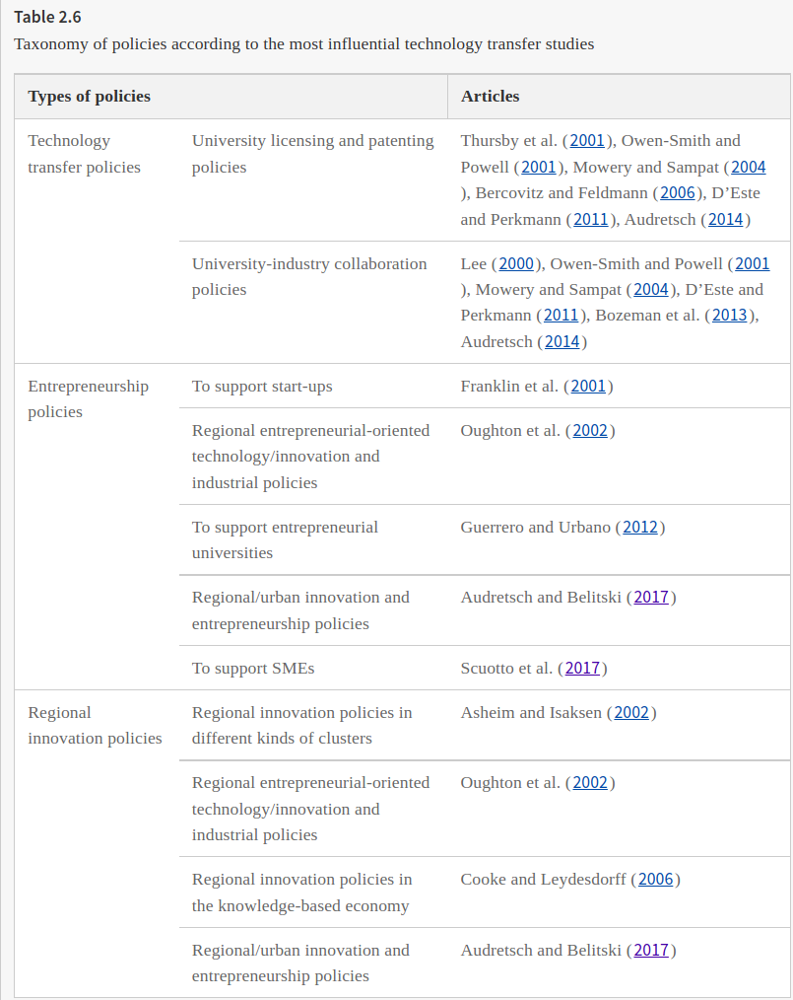
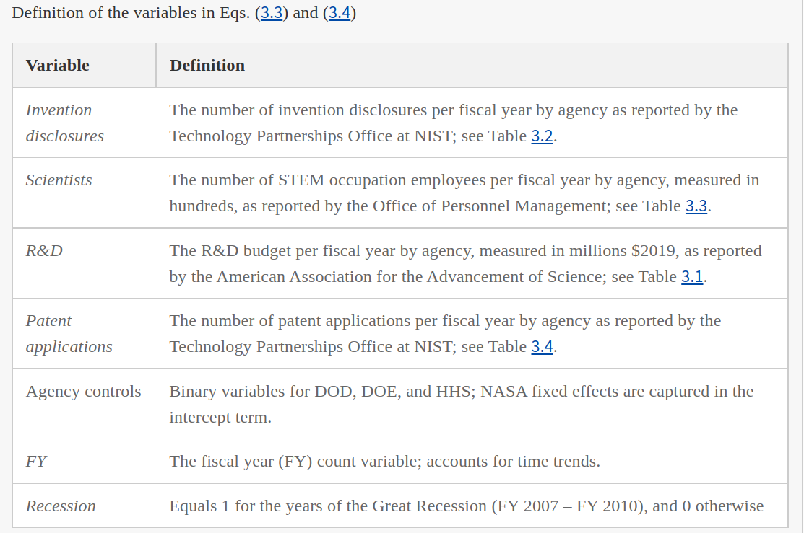
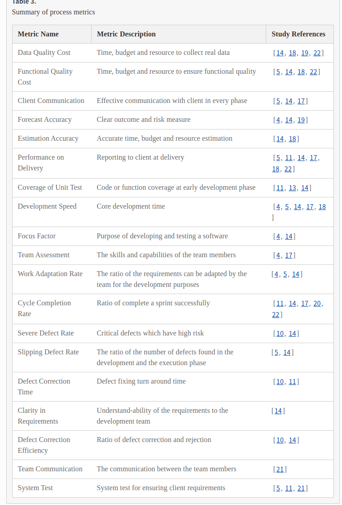
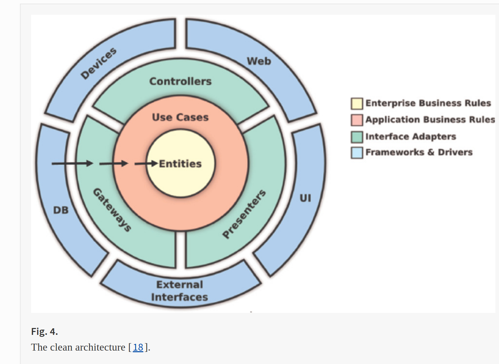
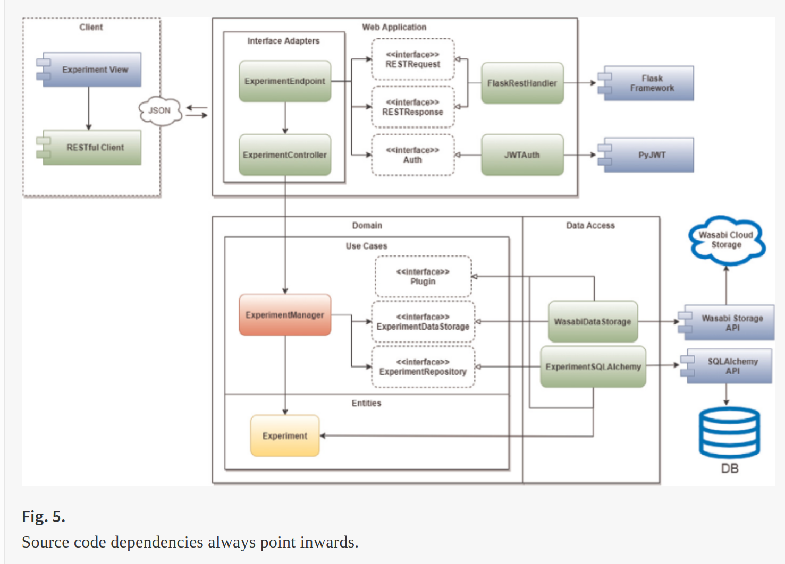
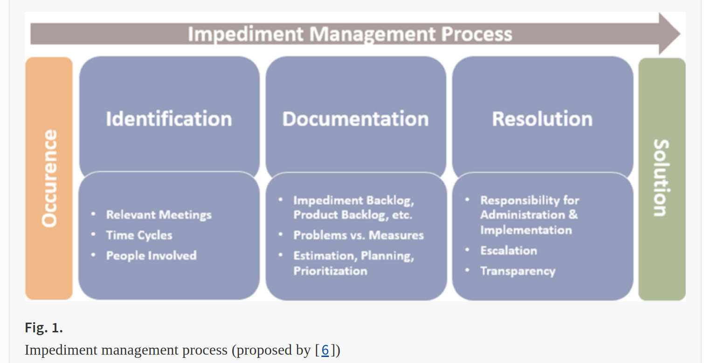
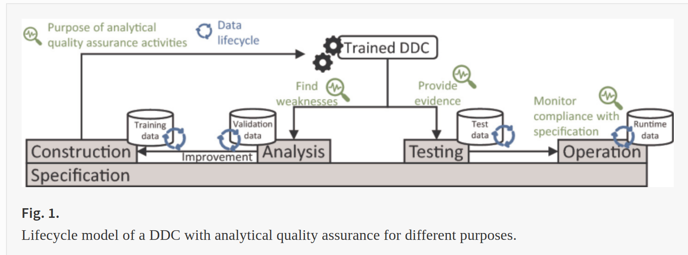
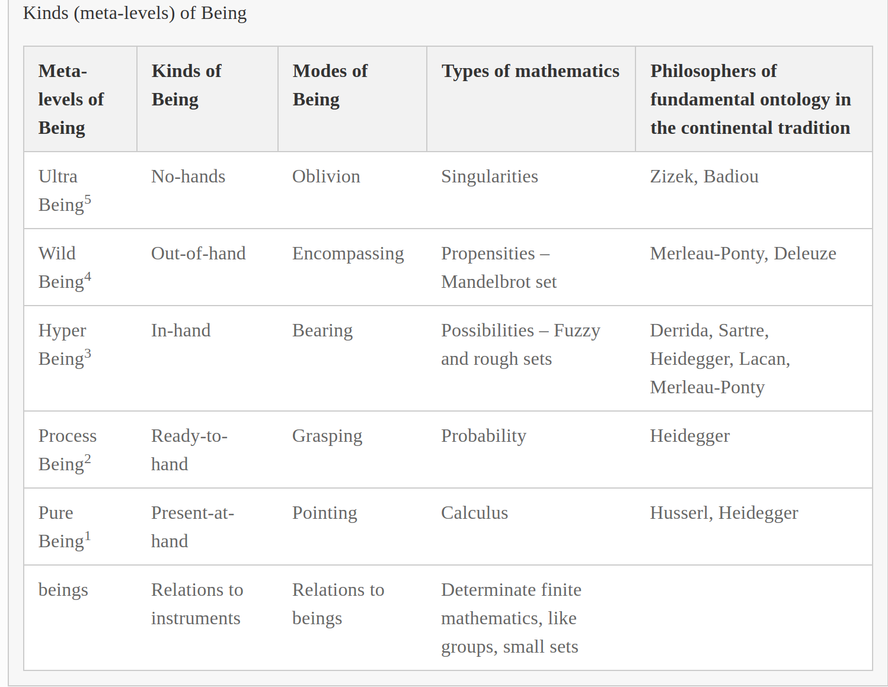
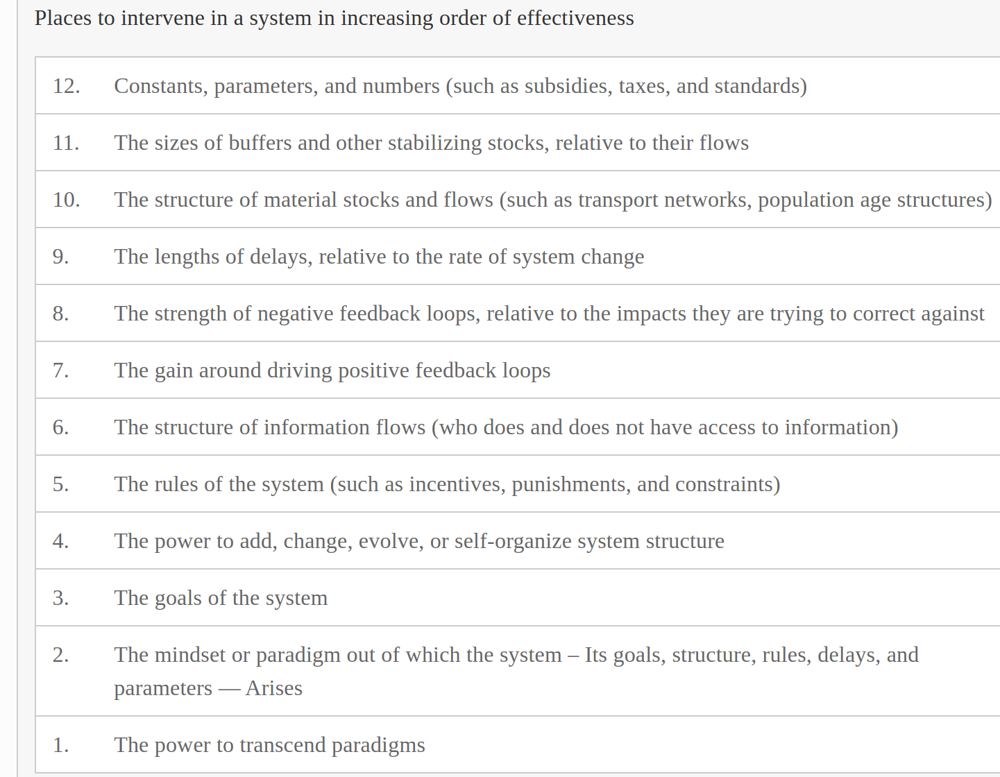

dec 18, 2021

springer

economics "technology transfer" "intellectual property" licensing software kubernetes

---

# Leading Trends in Technology Transfer

Technology Transfer and Entrepreneurial Innovations pp 21-41

Schumpeter’s seminal works on innovation research (Schumpeter 1934, 1942) coined the terms creative destruction and creative accumulation: the first concept refers to entrepreneurs and new firms (what he defined as agents of creative destruction) introducing change to the economic landscape, undermining and challenging established industry incumbents; the latter focuses on the relevance of large established firms in R&D for technological innovation. After such works, the following pioneers’ studies covered economics, sociology, management, organizational studies, psychology, political science, and, very rarely, interdisciplinary contributions. It was not until the early 1980s that a common conceptual framework emerged based around the economics of innovation, technology and growth, the interactive model of the innovation process, and, later, the notion of innovation systems (both from national -National Innovation Systems (NIS)- and regional -Regional Innovation Systems (RIS)- approaches), innovation policies, the management of the industrial innovation and the resource-based view of the firm, the technology transfer, and the knowledge management, among others (Fagerberg and Verspagen 2009; Martin 2012).



---

# Entrepreneurial ecosystems in cities: establishing the framework conditions

The Journal of Technology Transfer volume 42, pages1030–1051 (2017)

This study focuses on regional entrepreneurial ecosystems and offers a complex model of start-ups, Regional Entrepreneurship and Development Index (REDI) and six domains of the entrepreneurial ecosystem (culture, formal institutions, infrastructure and amenities, IT, Melting Pot and demand).

Hypothesis 1:
Local culture that facilitates trust and safety is likely to improve the entrepreneurial ecosystem.

---

# Ambidexterity, external knowledge and performance in knowledge-intensive firms

The Journal of Technology Transfer volume 42, pages374–388 (2017)

An ambidextrous firm is one that is capable of both exploiting existing competencies and exploring new opportunities, and achieving ambidexterity enables a firm to enhance its competitiveness and performance (Lubatkin et al. 2006; Carayannis and Rakhmatullin 2014). Although the literature substantially investigates the concept of organizational ambidexterity, highlighting the complementarities, contingencies and limitations of exploitation and exploration, few studies consider the strategic role of external knowledge in enhancing ambidexterity and firm performance. This relationship is even less studied in the context of knowledge-intensive firms (KIFs). In fact, to cope with the increasing technological complexity and market uncertainty (Thrassou 2007), KIFs must increasingly involve external sources of knowledge within their innovation process (Enkel et al. 2009), based on the extent of the ambidextrous strategy adopted. KIFs are those “having a high added value of scientific knowledge embedded in both product and process” (Coviello 1994), such as firms operating in information and communication technologies (ICT) and in high-technology manufacturing sectors such as electronics (Bell et al. 2004). This knowledge-based embedded added value also constitutes a primary reason for this research’s natural focus on KIFs.


---

# The effect of social networking sites and absorptive capacity on SMES’ innovation performance

The Journal of Technology Transfer volume 42, pages409–424 (2017)

---

# Technology Transfer at U.S. Federal Laboratories: R&D Disclosures Patent Applications

Technology Transfer and Entrepreneurial Innovations pp 45-58

In an ideal world, as described by Fig. 3.1, the technology transfer process begins with R&D, and then the rest of the process is based on disclosed inventions. Namely: R&D → Invention disclosures → Patent applications → Patents awarded → Patents licensed.13 The R&D → Invention disclosures → Patent applications portions of this process, as shown in the shaded areas in Fig. 3.1, are laboratory specific, meaning that they are internal to the federal laboratory.

The Patents awarded → Patents licensed portion of the process involves the external [my emphasis] portion of the technology transfer process. I refer to this as the external portion because it is influenced by activities external to the laboratory, such as the infrastructure of the U.S. Patent and Trademark Office (USPTO), changes in patenting regulations, as well as the cyclical nature of market demand for laboratory-based patented technology.

Consider a model of inventions disclosures within a federal laboratory of the form:
Inventiondisclosures=f(HC,TC)
(3.1)
where HC refers to human capital, and TC refers to technical capital. A reduced form of Eq. (3.1) is:
Inventiondisclosuresper100scientists=F(TC)
(3.2)
where the variable Scientists is used to approximate HC, and the functional form of f (·) need not be the same as F (·). As previously mentioned, and as discussed in the following section of this chapter, the available data on technology transfer in federal laboratories are laboratory data aggregated to the agency level. Using agency-level metrics, Eq. (3.2) might be expressed as:
Inventiondisclosuresper100scientists=F(R&Dper100scientists,X)
(3.3)
where the variable R&D per 100 scientists approximates TC and where vector X includes agency fixed effects.17 And along with Eq. (3.4), the second component of the internal laboratory relationship might be expressed as:
Patentapplicationsper100scientists=F(Inventiondisclosuresper100scientists,X)
(3.4)



---

# Antecedents and Consequences of Innovation via R&D in Europe

Technology Transfer and Entrepreneurial Innovations pp 117-142

---

# Software Process Metrics in Agile Software Development: A Systematic Mapping Study

International Conference on Computational Science and Its Applications
ICCSA 2021: Computational Science and Its Applications – ICCSA 2021 pp 15-26



---

# The SCCOPLA (An extenSible arChitecture for empiriCal sOftware Engineering comPutational pLAtform)

International Conference on Computational Science and Its Applications
ICCSA 2021: Computational Science and Its Applications – ICCSA 2021 pp 231-246





---

# DevOps Job Roles: A Multivocal Literature Review

International Conference on Computational Science and Its Applications
ICCSA 2021: Computational Science and Its Applications – ICCSA 2021 pp 247-256

**Product Owner**
A product owner is responsible for representing client during the entire lifecycle from development to deployment. It is real operation role that links business to project management. And product owner is responsible for managing the product backlog. Product owners understand the vision of project and responsible for deliveries, with fewer deliveries before DevOps, but now with DevOps they must move faster to keep up with instant updates. Product owners also needs to think in terms of system [18].

**Architect**
A crucial member of the team as they are responsible for setting up system and functional architecture. They must strongly communicate with project manager to exchange information. Architect is responsible for setting up smooth transition between development and operation functions [3]. Architect focus is towards setting up smooth CI part in the DevOps pipeline.

**Production Engineers**
Production Engineers are production integrators, they are also tester and responsible for productions. operations, incident monitoring, user support.

**Department/Project Manager**
Project managers are responsible for collaborating between all other actor, to debate budget, tracking and prioritization of items. Sometimes also work with functional architecture.

**Release Manager**
Release manager is a crucial member towards safeguarding success of project. They are responsible for handling Constant Delivery (CD) part of a DevOps pipeline [19].

**Automation Level 1 (Agile)**
Automation level 1 represents traditional agile development life cycle in which development and operations are working in silos without any proper sharing, no automation in release so it’s fine to say the DevOps is not realized during automation level 1.

**Automation Level 2 Continuous Integration**
The operation requests to be in line with development, during this automation process more focus is provided toward the integration part between development and operation, the reason behind is company policy toward rapid movement of code form development to production, performs unit testing, study shows that 53% of companies using DevOps prefer continuous integration [20].

**Automation Level 3 Continuous Deployment**
Fully automated DevOps pipeline performs integration testing, user testing, performance testing. Here the development needs to be aligned with operations. Greater the level of automation requires more sharing and mutual discussion.

---

# Security as Culture: A Systematic Literature Review of DevSecOps

https://dl-acm-org.uwinnipeg.idm.oclc.org/doi/10.1145/3387940.3392233

---

# Team Topologies in Software Teams: A Multivocal Literature Review

International Conference on Computational Science and Its Applications
ICCSA 2021: Computational Science and Its Applications – ICCSA 2021 pp 272-282

We found four different types of teams:

**Stream aligned teams**: Present an end to end responsibility on a new functionality or change, including operation roles in production.

**Enabling teams**: They empower the previous type to upsurge their competences for a given time (new technology, new process…)

**Complicated subsystem teams**: They are skilled specialists that would be hard to place into stream aligned teams because their dissimilarities.

**Platform teams**: Platform specialists aimed to fast-track or make straightforward software delivery for the first group.


---

# Keeping the Momentum: Driving Continuous Improvement After the Large-Scale Agile Transformation

International Conference on Product-Focused Software Process Improvement
PROFES 2021: Product-Focused Software Process Improvement pp 66-82

The Scaled Agile Framework (SAFe) is currently the most popular framework to scale agile development to large projects and organisations. An organisational transformation to SAFe is usually driven by a Lean-Agile Centre of Excellence (LACE)

The agile transformation is often called a journey that does not end after the initial transformation is over, but will continue in the form of continuous improvement through self-inspection and reflection. The SAFe framework does not specify how the continuous improvements should be driven, who should be driving them, nor what exactly the role of LACE should be. The SAFe lists the typical responsibilities of LACE, which include also “helping to establish relentless improvement”

SAFe recommends a transition based on the 7-step process introduced by Kotter [14], a strategy for realising a stated vision by implementing deliberate changes by changing systems and structures supported by a powerful guiding coalition

The overall goals of the LACE to be: 1) relentless improvement, 2) cross-organisational scope, and 3) increased customer focus

We are not interested in sub-optimising problems in some specific area only. And typically, there’s not many problems, which are specific to some area only. [...] If there’s no vehicle, these problems stay inside those silos, because there’s no way to raise them up. So that’s, of course, the way to provide this vehicle where you can raise and then what this vehicle tries to do is exactly, we talk about systemic issues.” 

Currently, the most important features as identified by the Product Owners are: “Clear Line of Sight”, aiming to display the relations between smaller features and strategic projects, and “Feature Lead Time”, targeting shorter delivery times of development features by implementing a metrics dashboard

Additional ongoing LACE features include “Lean Business Cases”, a tool to clarify the expected value of features, and a “Team Role-Card”, describing the responsibilities of an agile development team to align expectations across the organisation.


While SAFe suggests a strategy resembling the Commanding intervention type identified by Huy [12], the Nordea LACE resembles the Socializing intervention type [12] in its democratic approach to change, empirical normative tactic, and participatory and experimental approach conducted in continuous work groups, relying more on organic and incremental spread of change similar to the views of Tsoukas and Chia [26] than the top-down implementation of Kotter [14], on which SAFe bases its recommendation.

---

# How Do Agile Teams Manage Impediments?

International Conference on Product-Focused Software Process Improvement
PROFES 2021: Product-Focused Software Process Improvement pp 49-65



---

# Towards a Common Testing Terminology for Software Engineering and Data Science Experts

International Conference on Product-Focused Software Process Improvement
PROFES 2021: Product-Focused Software Process Improvement pp 281-289

In complex software-intensive systems, analytical quality assurance (QA) activities, especially software testing, have proven to be crucial for achieving high product quality. Due to the increasing relevance of Artificial Intelligence (AI) and Machine Learning (ML) as part of software systems, the question arises how AI/ML-enabled systems, and especially their AI/ML-based components, should be tested. The functionality of such components, which we refer to as data-driven components (DDCs), is not explicitly defined by a specification and implemented by a programmer within the code. Instead, it is given by a – usually complex and not human-understandable – model that is automatically derived from a data sample via a learning algorithm. Due to properties such as limited specification and understandability, the transfer of classical test approaches is not trivial.

A test object or test item is defined as “a software or system item that is an object of testing” [5] and implements a (sometimes implicit) specification. A specification is “a document that specifies, in a complete, precise, verifiable manner, the requirements, design, behavior, or other characteristics of a system or component, and, often, the procedures for determining whether these provisions have been satisfied” [6]. The test object is tested against the requirements, i.e., the required capabilities of the system or system component [6], and against quality characteristics. In this work, we focus on software component testing, which is defined as “testing of individual hardware or software components or groups of related components” where a component is “one of the parts that make up a system […] and may be subdivided into other components” [6]. Each component contributes to a specific function or set of functions of its associated system.




---

# Autonomic Computing in Cloud: Model and Applications

Autonomic Computing in Cloud Resource Management in Industry 4.0 pp 41-57

Metrics for resource provisioning management in cloud

Name of the Scheme

Functionality

Fault-Tolerant Scheduling [1]

It is dynamic and provides high resource utilization and high schedulability

Online Auction Framework [2]

It follows auction mechanism and provides optimized system efficiency

Meta-heuristic Optimization Technique [13]

It follows particle swarm optimization (PSO) technique and provides minimized workflow execution cost

Agent-based automated service composition (A2SC) [14]

It follows A2SC algorithm and provides reduced VM service cost

Fault Aware Resource Provisioning [15]

It follows FARP algorithm and provides service to redirect the user’

On-Demand Provisioning [16]

It follows augmented shuffled frog leaping (ASFLA) algorithm and provides minimized cost for execution and time

High bandwidth Provisioning [17]

It follows polynomial time energy-aware routing algorithm and provides energy-aware paths to allocate servers and switches for accommodating traffic requests

Fault Tolerance, Fault Detection, and Fault Recovery [18]

Provides self-healing, self-detection, preemptive migration, checkpoint, restart, replication, system node recovery, and job migration techniques

Hybrid Approach [5]

Combination of autonomic computing and reinforcement learning (AC & RL) that could predict the future demands for the cloud services


**Advantages of autonomic computing vs. traditional computing**

Autonomic feature

Traditional computing

Autonomic computing

**Self-configuration**

Installing, configuring, and integrating systems is error-prone and time-consuming

Automated configuration of components and systems follows high-level policies. Rest of the system adjusts automatically and seamlessly

**Self-healing**

Systems have hundreds of manually set nonlinear tuning parameters and their number increases with each release

Components and systems continuously seek opportunities to improve their own performance and efficiency

**Self-optimization**

Problem determination in large, complex systems can take a team of programmers weeks

System automatically detects, diagnoses, and repairs localized software and hardware problems

**Self-protection**

Detection and recovery from attacks and cascading failures is manual

System automatically defends against malicious attacks; it uses early warning and prevents system side failures


---

# Time for All Programs, Not Just Real-Time Programs

International Symposium on Leveraging Applications of Formal Methods
ISoLA 2021: Leveraging Applications of Formal Methods, Verification and Validation pp 213-232

We begin by outlining four design patterns in distributed systems that we call alignment, precedence, simultaneity, and consistency. All of these patterns have many possible implementations that do not require any temporal semantics at all, but in each case, we will give a solution that uses temporal semantics. Our solutions will use a rather new programming framework called Lingua Franca (LF) [25] that supports concurrent and distributed programming using time-stamped messages. 

Three smokers are sitting at a table. One of them has tobacco, another has cigarette papers, and the third one has matches—each one has a different ingredient required to make and smoke a cigarette but he may not give any ingredient to another. On the table in front of them, two of the same three ingredients will be placed, and the smoker who has the necessary third ingredient should pick up the ingredients from the table, make the cigarette and smoke it. Since a new pair of ingredients will not be placed on the table until this action is completed, the other smokers who cannot make and smoke a cigarette with the ingredients on the table must not interfere with the fellow who can.

In the year 2000, Eric Brewer (of Berkeley and Google) gave a keynote talk [4] at the Symposium on Principles of Distributed Computing (PODC) in which he introduced the **“CAP Theorem,”** which states that you can have only two of the following three properties in a distributed system:

**Consistency**: Distributed components agree on the value of shared state.

**Availability**: Ability to respond to user requests.

**tolerance to network Partitions**: The ability to keep operating when communication fails.

---

# Towards Living Canvases

International Symposium on Leveraging Applications of Formal Methods
ISoLA 2021: Leveraging Applications of Formal Methods, Verification and Validation pp 95-116

Among the world’s ten most valuable organizations, seven are based on business models exclusively driven by data. Not one of them is from Europe.

Since the Business Model Canvas (BMC) by Osterwalder was published in 2010 the canvas’ role in brainstorming workshops received increasing attention [1]. In time, various authors proposed canvases (also called visual inquiry tools) for a wide array of application domains and applied them to business and research contexts [2, 3]. Each canvas supports a specific target segment/problem scope with a mapped-out overview of the most relevant aspects to consider and define. Canvases aim at supporting their users in all kinds of decision-making e.g., from industry analysis (PESTEL [4]), status-quo analysis (e.g., SWOT [5]), competitor analysis (Porter’s five forces [6, 7]), to Business Model design (BMC [1]). The unique selling proposition of using canvases is clear: the problem gets structured and tangible at one glance. This eases interdisciplinary communication, collaboration and alignment.

Canvases are collaborative ‘frameworks’ to design new solutions, foster innovation, and, in general, enable their users to work jointly even across disciplines

AI-based ETA (Artificial Intelligence based Estimated Time of Arrival)

The BMD and GOLD tools use the metamodeling and generation power of the CINCO framework [41] to define the syntax (look and feel) and the semantics of a (canvas), to define and generate fully functioning editors that are canvas tools

---

A **stigmergy** is a mode of communication where agents interact by means of traces in a shared environment.

---

# Team Systems Theory: Building Stakeholder Value Through a Learning Culture for Organizational Resilience

Handbook of Systems Sciences pp 1361-1403

In a recent study about organizational resilience conducted by the RAND Corporation, Langeland, Manheim, McLeod, and Nacouzi (2016) state,

    Resilience is an indication of the ability of a system, architecture, or organization to meet the operating objective by maintaining or recovering critical capabilities when under attack, stressed, or otherwise compromised. Ensuring resilience can be a costly endeavor, and in a financially constrained environment, innovative approaches for assuring this resilience are required. (p. 1)

The National Institutes of Health (NIH) have developed guidelines for researchers to help them design high-quality mixed methods research studies, emphasizing that design should account for multiple dimensions for validity. Here is a summary of the guidelines:

**Purpose** – addresses credibility (integrity), context (generalizability), illustration of quantitative results through qualitative data, utility, hypotheses development and confirmation, and perspective diversity.

**Theoretical drive** – inductive, deductive, or equal status basis for the composition of the research question(s).

**Simultaneity and dependency** – discernment of parallel or sequential design and event timing as dependent or independent.

**Integration point** – points at which the divergent methods converge during results compilation (e.g., joint display of qualitative and quantitative data) and analysis for deeper understanding.

**Interactive versus typological approach** – design as a product (taxonomy) or process (dynamic).

**Emergent versus planned design** – adaptability of the design to new data.

**Complexity** – the degree is determined by the number of integration points.

The interpersonal dynamics established during this period will set the foundation for the team’s operating culture; which means, it is critical for leaders to instill respect, trust, and ethics to anticipate consequences at the project’s inception accomplished by creating the conditions for psychological safety7 (Edmondson 2003) to encourage calculated risk and learning.

Generally, communities of practice (CoPs) are knowledge-based social structures. According to Wenger, McDermott, and Snyder (2002), CoPs are “groups of people who share a concern, a set of problems or a passion about a topic, and who deepen their knowledge and expertise in this area by interacting on an on-going basis”(p. 4). CoPs were developed as a theory of situated learning – informal learning outside the classroom through participation and practice (Lave and Wenger 1991) that evolved to forms of knowledge management (KM)6. This interpretation of CoPs dovetails with Weick, Sutcliffe, and Obsfeld’s (2005) definition of sensemaking in organizations as “the ongoing retrospective development of plausible images that rationalize what people are doing” (p. 409). Sensemaking entails seven aspects that align with CoPs. Identity is essential to the other six aspects of sensemaking as it provides retrospective opportunities, enacts dialogue and narrative to understand complexity, establishes shared meaning through social engagement, emerges through ongoing feedback, extracts cues indicative of acceptability and relevance, and prefers plausibility over accuracy (Weick 1995).

A CoP is a group of people who share a generative activity or a profession. The concept of CoP evolved from Peirce’s pragmatism expressed as communities of inquiry (CoIs) (Shields 2003). CoIs are groups that conduct research (conceptual or empirical). CoIs emphasize social quality, and contingency of knowledge formation distinguishes them from research conducted using the Cartesian model of science, which posits a static reality, objectively knowable by rational observers. Because CoPs focus on knowledge embedded within a social context, intersubjective agreement among its members is required to establish legitimacy. Sharing information, experiences, and interests in a domain or sharing a common goal of developing knowledge in a particular field can be the impetus for a CoP.

Wenger, McDermott, and Snyder (2002) identified seven actions necessary to cultivate CoPs, summarized as follows:

1. **Design the community to evolve naturally** – CoPs are best designed to support shifts in focus as a CoP is dynamic – its interests, goals, and members are fluid.
 
2. **Scan the environment beyond the CoP to create opportunities** for open dialog engaging voices with outside perspectives even when members and their knowledge are its most valuable resource. A CoP benefits when members look outside its bounds to understand the different possibilities for achieving learning goals.
 
3. **Encourage multiple levels of participation** – Three levels of participation should be included – a core group whose participation is intense and focuses on discussions and projects and its members lead the group, an active group who regularly participate not to the level of the leaders, and a larger, peripheral group whose passive participation allows learning from their level of involvement. Provide space for growth for subject matter experts (SMEs) and interested stakeholders alike.

4. **Development of community spaces** – CoPs operate in public spaces where all members share, discuss, and explore ideas; they should also offer private forums for exchanges. These can be physical (e.g., meetings) and/or virtual (dialogue forums). Relationships and shared resources should be managed using customized approaches to meet specific needs.
 
5. **Focus on value** – CoPs should create opportunities for participants to discuss explicitly the value and productivity of their participation in the community.

6. **Balance familiarity and novelty** – In addition to meeting expected learning outcomes and as part of their structure and programming, CoPs should include opportunities for members to shape their learning experience. This may include brainstorming, possibly mind mapping, which examines conventional and radical wisdom related to their topic.
 
7. **Cultivate a consistent rhythm for the community** – CoPs should conduct a vigorous cycle of activities that encourage members to meet, reflect, and evolve. This means establishment of a sustainable rhythm – one that anticipates different levels of engagement and enables a vibrant, thriving community, yet is not so fast-paced and intense that it becomes unmanageable.

According to Cooperrider and Whitney (2001), five principles of appreciative inquiry are:

1. **The constructionist principle** states that ideas and action emerge from relationships built on shared beliefs and narratives, thus a co-created reality. Inquiry’s purpose is stimulation of thought and action that generates new opportunities based on customary interaction and dialogue.
 
2. **The principle of simultaneity** states that as humans inquire into their systems, the systems change and thus humans change in reciprocity. Questions are propitious, not be neutral. The questions that persist move social systems in directions they passionately explore.

3. **The poetic principle** states that organizational life is expressed as a narrative coauthored by its members in their daily stories. The selection of words and topics has impact far beyond the words themselves. Discernment is used to choose words that engage, invigorate, and inspire the best in people.

4. **The anticipatory principle** states that today’s actions are guided by our expectations of the future. Human systems anticipate and visualize horizons bringing the future powerfully into the present compelling action. Through collective creation of constructive imagery, appreciative inquiry transforms anticipatory reality.
 
5. **The positive principle** states positive affect and social bonding are required for momentum and sustainable change. Attitudes like enthusiasm, hope, friendliness, and curiosity increase openness to new ideas and people, cognitive flexibility, and creativity. Positive social bonding fosters strong relationships between people, which are required for collective inquiry and change as well as mitigating conflict when groups disagree.

---


# Making Inquiry More Systemic

Handbook of Systems Sciences pp 1333-1339

**Systems Concepts**

### 1. Holism

A system is a whole with emergent properties, that is, properties of the whole that are different from, and not possessed by individual parts or their sum (e.g., Checkland 1981; Morowitz 2002). For example, consciousness is not possessed by individual neurons but by the whole of the human mind. Holism in inquiry would focus attention on properties of the whole object or phenomenon, and go beyond typical analysis and reconstruction of parts.
 
### 2. Interdependence

The parts of a system interdepend, so change in one part will affect all others (e.g., von Bertalanffy 1968). Similarly, systems are interconnected with their environments, so change in the environment will impact the system and vice versa. For example, the actions of members of an educational institution will impact other members, and a change in political or economic climate will impact all. Inquiry taking interdependence into consideration would go beyond the study of parts and their static relationships, and examine internal and external dynamics.

### 3. Hierarchy

Systems can be defined at multiple levels and can be seen to be composed of subsystems and to be parts of supra-systems (e.g., Meadows 2008). For example, a learning system might be defined at the individual or class level, and the class could be considered a subsystem of a school. The key is where and how the boundary between the system and its environment is defined. Inquiry that attends to systems hierarchies would be conscious of boundary decisions and look above and below – at the larger system that is served, and at the mechanisms that make the system work.

### 4. Multi-perspective

Systems are better understood from multiple perspectives (e.g., Banathy 1996). For example, insights into the nature of an educational institution might be gained from the perspectives of differing stakeholders, through lenses that emphasize its social, cultural, economic, technological, or political characteristics, and/or with primary attention to governance, administration, instruction, or learning experience. A more systemic approach would value and include a very wide range of perspectives, for example, those of all stakeholders and those who have relevant expertise, thus extending the concept of triangulation. It would seek to be comprehensive, to be broad in scope, and, therefore, inevitably incorporate multiple methods and ways of knowing.

### 5. Complexity

Systems can be seen to possess degrees of dimensionality and complexity (e.g., Csikszentmihalyi 1993; Gell-Mann 1994). A simple system has few parts that are related in predictable ways (e.g., a lever). A complicated system has many parts that are not well integrated (e.g., a device with many functions but a difficult user interface). A complex system has many parts that are well integrated (e.g., a high-performing sports team). A more systemic inquiry would appreciate the complexity of the system(s) being studied, and match that with methods that were sufficiently complex to understand its nature.
 
### 6. Co-evolution

In order to develop, in fact, in order to survive, systems adapt to and co-evolve with their environments (e.g., Banathy 2000). Over time, this can be seen as a movement toward greater complexity, that is, toward simultaneously greater differentiation and integration (Casti 1994; Csikszentmihalyi 1993). For example, modern humans have developed and adapted to their environments in ways that make them more complex than their predecessors. A more systemic inquiry would consciously and continuously adapt, based on what was learned, and in response to continual changes in the systems and environments being studied.
 
### 7. Second-order understanding

Among the most important elements of systems science is the recognition that, while there are certainly interdependencies, hierarchies, and so on in the world beyond human experience, “systems” are human constructions (e.g., von Foerster 1974; Maturana and Varela 1988). In other words, a system is what we call a system. For example, we define the boundary of an educational system or any other system, we select the perspective(s) from which to view it, and we perceive it having, and describe it with, a certain level of complexity. An inquiry that is more systemic would recognize that we define the object of inquiry, the instruments by which it is studied, and the roles that we take in doing so, and it would require that we continually review the definitions, instruments, and roles with skepticism and a readiness for modification.

As a consequence of this reflection we would come to realize that our inquiry itself is a system – an inquiry system – constructed and applied by us in relationship to the system(s) we study. As such, it would be seen to possess all the systems characteristics above and require the same ongoing critique and modification. For example, coherence of the elements of inquiry, in particular among purposes, methods, and criteria, would be recognized as an instance of interdependency.

--- 

# General Schemas Theory

Handbook of Systems Sciences pp 1251-1281

**Pluriverse**
- Superstructure past all determinate discrimination

**Kosmos**
- Largest discriminable thing

**World**
- Largest set of human-projected coherences of perspectives based on a common language and culture

**Domain**
- Sets of disciplined and coherent perspectives rigorously maintained

**Meta-system**
- Environments or situations encompassed by horizons

**System**
- Objects and their relationships seen as gestalts within boundaries or upon a common ground

**Form**
- Shapes of figures of the different kinds of tangible things

**Pattern**
- Mixtures of discriminable elements to produce ordered variety

**Monad**
- Lowest isolatable element at an emergent ontic level

**Facet**
- Non-isolatable characteristic of the isolatable element



---

# Category Theoretic Foundations for Systems Science and Engineering

Handbook of Systems Sciences pp 1227-1249

**Axiom 1 (Object)**
An object is an existential thing consisting of an entity, an identity, a potential to aggregate other objects as components, and the necessity for its existence in at least one, but perhaps more contexts simultaneously.

**Axiom 2 (Category)**
A category is an object that adds or imposes structure upon its aggregation of objects. The structured objects in the aggregation may exist at different levels of abstraction or realization.

**Axiom 3 (Function)**
A function is an abstraction of a behavior or action.

**Axiom 4 (Functional Object)**
A functional object is an object that additionally exhibits a function, action, or behavior.

**Axiom 5 (Morphism)**
A morphism abstractly usually represents, by reference, a change in the objects, their structure, behavior, and even other morphisms. This includes a change in the number of objects, a change in structures between objects, a change in the nature in the aggregation or the whole, a change in specificity, or a change in level of abstraction. Morphism can be the result of functions and functional objects.

**Axiom 6 (Composition)**
A composition represents an unspecified abstract combination from any of the broad number of objects, functions (functional objects), and structures operating on and between other categorical components.

**Axiom 7 (Functor)**
A functor is a category whose objects are functional objects, and other functors.

**Axiom 8 (Context)**
A context is a category – usually realized as a space, metric space, or “world” represented in a “Fraktur” script font, such as ℭ – that conditions the possibility for the existence of objects in its aggregation

**Axiom 9 (Domain)**
A domain is a category or context in which all the objects, their structure, behavior, and morphism have proven to be valid.

---

# Developing a Sustainable Employee-Owned Chemical Company

Handbook of Systems Sciences pp 617-642

Scott Bader was created in 1921 by a Quaker, Ernest Bader. It started as a distributor of chemical products, based in London. Today it is a global manufacturer of polymers used in an array of applications. It operates across the globe through 8 plants on 5 continents, employing 700 colleagues, as they are called, and generating $300 m in revenues annually.

defining sustainable development as “development that meets the needs of the present without compromising the ability of future generations to meet their own needs” (Sustainability report 2015) 




https://medium.com/disruptive-design/tools-for-systems-thinkers-the-12-recurring-systems-archetypes-2e2c8ae8fc99

---

# Meta-methodology for Risk Management

Handbook of Systems Sciences pp 185-216

**Epigrams from the Past**

(i). “Death sneaks upon us from the back door not the front.” (Yoshida 1985)
 
(ii). “Watch out for the undertow.” “Death, it seems, does not like to wait until we are prepared for it. Death is indulgent and enjoys, when it can, a flair for the dramatic.” (Irving 1984)

The world is full of uncertainty, as this Japanese essayist and American novelist observed about the unpredictability of life.
 
(iii). “Analysis destroys wholes. Some things, magic things, are meant to stay whole. If you look at their pieces, they go away.” (Waller 2003)

This quote reminds us of a reductionist approach which deprives holistic features of an object.

(iv). “Fools say they learn from experience; I prefer to learn from the experience of others.” (Otto von Bismarck Cited in Samuel 1950)

 
(v). “Discover something new by looking back on a past.” (Old Chinese saying)

Those two quotes show the importance of learning from the others.

Furthermore, there is such urgency for moving to implementation of the proposed activities; we should not wait until we have all the information. We all face the dilemma between “analysis by paralysis” and “extinct by instinct.” In this regard, the quote from General Collin Powell’s Primer in Leadership (Harari 2003) is practical:

 
(vi). Part I: “Use the formula P = 40 to 70, in which P stands for the probability of success and the numbers indicate the percentage of information acquired.”

Part II: “Once the information is in the 40 to 70 range, go with your gut.”

The other epigram is the pitfall of goal-seeking model. It often leads us to the place where we are all burned out.

 
(vii). “The meaning of stability is likely to remain obscured in western cultures until they rediscover the fact that life consists in experiencing relations, rather than in seeking goals or ‘ends’…..

The barren contradiction of life, where this truth is overlooked, seems to me to be well, though unconsciously, expressed in line by Louis Untermeyer which have, significantly, became a favorite quotation in north America –

```
From compromise and things half done

keep me with stern and stubborn pride,

and when at last the fight is won,

God keep me still dissatisfied.” (Vickers 1972)
```
 
(viii). “The horror of that moment” the king went on,

“I shall never, never forget”

“You will though” the queen said, “if you don’t make a memorandum of it”

Lewis Carroll, Through the Looking Glass (1871)

The various epigrams make us aware that the world is full of uncertainty and make us humble although they are not much practical help to struggle with real problems we face.

The end note is the passage from the great poet William Wordsworth (1998) (1770–1850). He also had noticed the importance of holistic properties, at the end of his life, in his work “The Prelude.”

```
Dust as we are, the immortal spirit grows

Like harmony in music; there is a dark

Inscrutable workmanship that reconciles

Discordant elements, makes them cling together

In one society. (The Prelude, 1850) (Wordsworth 1998)
```


Class 1 (**Failure of deviance**): The root cause is within the system boundary, and conventional troubleshooting techniques are applicable and effective.

Class 2 (**Failure of interface**): The root cause is outside the system boundary but is predictable in the design phase.

Class 3 (**Failure of foresight**): The root cause is outside the system boundary and is unpredictable in the design phase.
