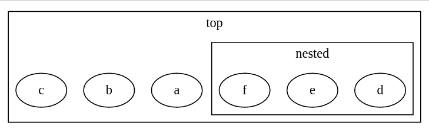

the following code generates a dot file

```python
    c = Cluster(name="top")
    c.contents = ['a', 'b', 'c']
    

    d = Cluster(name="nested")
    d.contents = ['d', 'e', 'f']
    
    c.add_cluster(d)
    self.digraph.add_cluster(c)

```

graph1.dot looks like:

```
digraph d {
subgraph cluster_top { 
a 
b 
c 
subgraph cluster_nested { 
d 
e 
f 
label = "nested"}
label = "top"}
}

```

